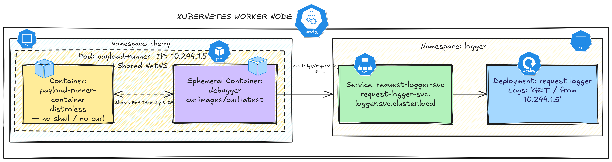

### Commands
```bash
kubectl debug -it -n cherry pod/payload-runner --target=payload-runner-container --image=curlimages/curl:latest -- sh
```

### Errors


```bash
kubectl debug -it -n cherry pod/payload-runner --target=payload-runner-container --image=curlimages/curl:latest
# Targeting container "payload-runner-container". If you don't see processes from this container it may be because the container runtime doesn't support this feature.
# Defaulting debug container name to debugger-2lbts.
# All commands and output from this session will be recorded in container logs, including credentials and sensitive information passed through the command prompt.
# If you don't see a command prompt, try pressing enter.
# Session ended, the ephemeral container will not be restarted but may be reattached using 'kubectl attach payload-runner -c debugger-2lbts -n cherry -i -t' if it is still running
```
```bash
# SOLUTION
# curlimages/curl:latest ---> entrypoint --> curl --> overwrite it to --> sh/bash
```

### Common Kubernetes debugging images

| Image                      | Best for                            | Important tools                                                        |
| -------------------------- | ----------------------------------- | ---------------------------------------------------------------------- |
| `busybox`                  | Basic debugging                     | `sh`, `wget`, `nslookup`, basic Unix tools                             |
| `alpine`                   | Lightweight general debugging       | `sh`, `wget`, `apk`, basic networking                                  |
| `nicolaka/netshoot`        | **Networking/debugging**            | `curl`, `dig`, `nslookup`, `tcpdump`, `ss`, `ip`, `traceroute`, `nmap` |
| `ubuntu`                   | General Linux debugging             | `bash`, `apt`, common utilities                                        |
| `debian`                   | General Linux debugging             | `bash`, `apt`, networking utilities                                    |
| `alpine:latest`            | Minimal shell/debug                 | `sh`, `apk`, `wget`                                                    |
| `wbitt/network-multitool`  | Kubernetes/network troubleshooting  | `curl`, `wget`, `dig`, `nslookup`, `ping`, `tcpdump`, etc.             |
| `praqma/network-multitool` | Network troubleshooting             | Network utilities + web server                                         |
| `nicolaka/netshoot`        | Advanced network investigation      | `tcpdump`, `tshark`, `ip`, `ss`, `dig`, `mtr`, `nmap`, etc.            |
| `busybox:stable`           | Tiny ephemeral container            | `sh`, `wget`, `nslookup`, `ping`                                       |
| `curlimages/curl`          | HTTP/API testing                    | `curl`                                                                 |
| `redis`                    | Redis troubleshooting               | `redis-cli`                                                            |
| `postgres`                 | PostgreSQL troubleshooting          | `psql`                                                                 |
| `mysql`                    | MySQL troubleshooting               | `mysql`                                                                |
| `mariadb`                  | MariaDB troubleshooting             | `mariadb` client                                                       |
| `bitnami/kubectl`          | Kubernetes API troubleshooting      | `kubectl`                                                              |
| `alpine/k8s`               | Kubernetes administration/debugging | `kubectl`, Helm and other utilities                                    |

```bash
kubectl debug pod/my-pod -it \
  --image=nicolaka/netshoot \
  --target=my-container \
  -- /bin/bash

kubectl debug pod/my-pod -it \
  --image=busybox:stable \
  --target=my-container \
  -- sh

kubectl debug pod/my-pod -it \
  --image=ubuntu \
  --target=my-container \
  -- bash

kubectl run curl --rm -it \
  --image=curlimages/curl -- sh

```