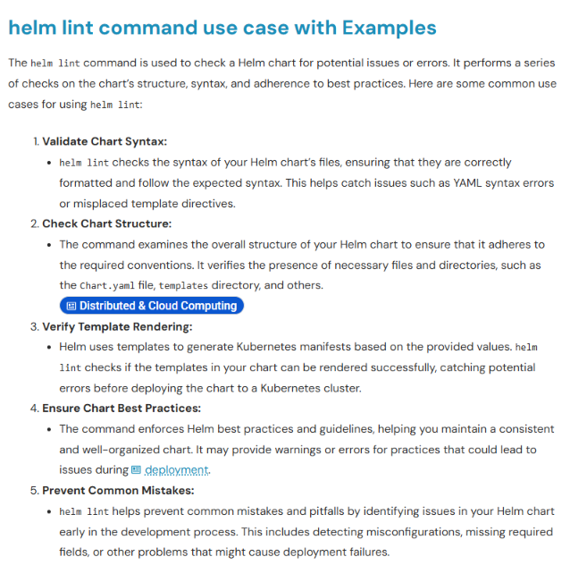
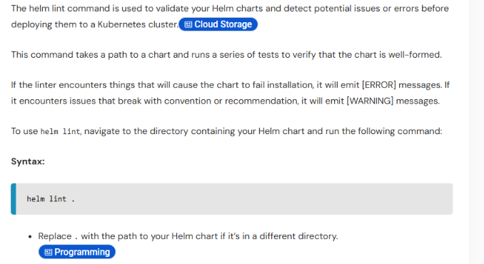

But it is not going to flag the issue in the naming of variables in the templates,values.yaml.

And in my observation is can delete issue in predefine keywords, funtions and values from _helper.tpl file, indentation etc