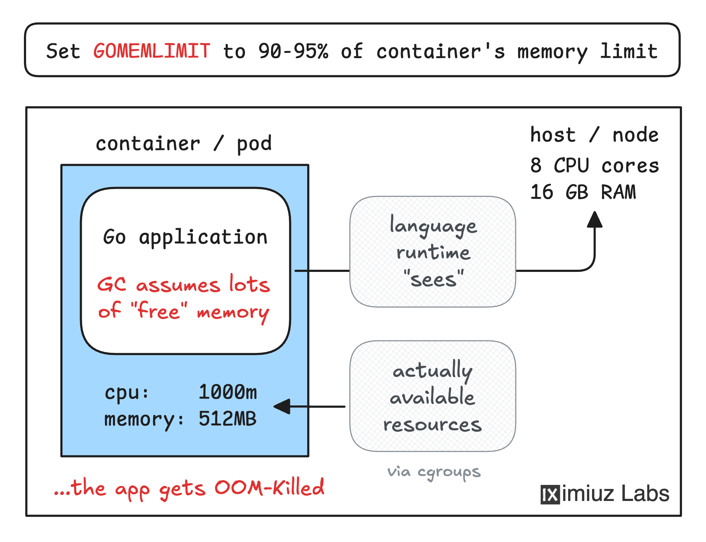

This is a classic and excellent case study in debugging a containerized Go application. The problem isn't with your application's logic, but rather a communication gap between the Go runtime and its containerized environment.

Let's break down the diagnosis and the solution step-by-step.

### 🔬 Step 1: Diagnosis - What's Really Happening?

First, let's confirm the symptoms from your description:

*   **Constant Load:** 4 concurrent requests.
*   **Resource Usage:** ~100MB per request → ~400MB total.
*   **Memory Limit:** 512MB.
*   **Symptom:** Repeated crashes (OOMKilled) after ~half a dozen requests.

If you inspect the pod, you'd see something like this:

```bash
kubectl describe pod <memhog-pod-name>
# ...
# Last State:     Terminated
#   Reason:       OOMKilled
#   Exit Code:    137
```

The math seems to work (400MB < 512MB), so why the OOM kill? The answer lies in how the Go runtime understands its memory environment.

### 🧠 Step 2: Root Cause - Why the Disconnect Happens

The root cause is a mismatch between the memory the Go runtime *thinks* it can use and the memory the container is *actually* allowed to use.

1.  **Container Illusion:** By default, a containerized application sees the total memory of the host node, not its own cgroup limit. So, a Go application on a node with 16GB of RAM believes it has ~16GB available, even if its pod has a 512MB limit.
2.  **Go's GC Behavior:** The Go garbage collector (GC) is designed to be efficient. It's lazy and doesn't run frequently unless there's memory pressure. It uses a "soft" limit (`GOMEMLIMIT`) to decide when to start collecting more aggressively. Without a `GOMEMLIMIT`, the GC sees no pressure and waits, allowing the heap to grow.
3.  **The Result:** The Go process happily allocates memory for the 4 requests, its RSS (Resident Set Size) grows beyond 512MB, and the kernel's OOM killer terminates it because it violated the cgroup limit. The application never got a chance to trigger its own garbage collection.

This is a very common issue, and the Go community has a clear best practice for it.

### 💡 Step 3: The Fix - Communicating the Limit to Go

The fix is to tell the Go runtime about its memory constraint. The primary tool for this is the **`GOMEMLIMIT`** environment variable.

`GOMEMLIMIT` sets a **soft memory limit** for the Go runtime. When the application's memory usage approaches this limit, the GC will run more frequently and aggressively to stay below it. It's a signal to the GC to work harder, not a hard cap.

**Crucially, you should not set `GOMEMLIMIT` equal to the container's memory limit.** You need to leave some headroom for non-heap memory usage (like goroutine stacks, OS buffers, etc.). A common and safe best practice is to set it to about **90% of the container's memory limit**.

So, for your 512MB limit:
*   **512 MB * 0.9 = 460.8 MB**
*   You can set `GOMEMLIMIT=460MiB`.

### 🛠️ Step 4: Implementation - Applying the Fix in Kubernetes

Since you cannot change the application image or entrypoint, you can inject the `GOMEMLIMIT` environment variable into the pod's container spec. Here is an updated pod manifest:

```yaml
apiVersion: v1
kind: Pod
metadata:
  name: memhog
spec:
  containers:
  - name: memhog
    image: <original-image> # Cannot be changed
    command: <original-command> # Cannot be changed
    resources:
      limits:
        memory: "512Mi" # Constraint: preserve original limit
    env:
    - name: GOMEMLIMIT
      value: "460MiB" # ~90% of 512MB
```
or
```bash
kubectl set env deployment/memhog GOMEMLIMIT=350000000
```


With this configuration, when the Go application's memory usage approaches 460MiB, the GC will become much more proactive, preventing the container's total memory usage from hitting the 512MB cgroup limit and avoiding the OOM kill.

### ✅ Step 5: Verification - Confirming the Fix

After applying the updated manifest, you can verify the fix with these steps:

1.  **Check the Pod's Stability:** Watch the pod's restart count. It should no longer increase.
    ```bash
    kubectl get pod memhog -w
    ```
2.  **Monitor Memory Usage:** Use `kubectl top pod memhog` to see that memory usage stays consistently below the 512MB limit and is more stable.
3.  **Check the Logs:** Ensure the application is serving requests successfully without any OOM-related errors.

### 💎 Advanced Considerations & Best Practices

For a truly robust solution, consider these additional points:

*   **`GOMAXPROCS` and CPU Limits:** Just as Go doesn't understand memory limits by default, it also doesn't understand CPU limits. If your pod has a CPU limit (e.g., `limits.cpu: "2"`), the Go runtime will see all the host's CPUs and create more OS threads than necessary, leading to context-switching overhead. The best practice is to use a library like **`automaxprocs`** or set the `GOMAXPROCS` environment variable to match the CPU limit. You can even use the Kubernetes **Downward API** to do this automatically:

    ```yaml
    env:
    - name: GOMAXPROCS
      valueFrom:
        resourceFieldRef:
          resource: limits.cpu
    ```
    *Note: Go 1.25+ has improved automatic detection for CPU limits*.

*   **`GOGC` Tuning:** `GOMEMLIMIT` is a soft limit that influences the GC, but you can also directly tune its frequency with the `GOGC` variable. The default is `100`. Lowering it (e.g., to `50`) makes the GC run more often, which can be useful for memory-constrained applications. Conversely, raising it (e.g., to `200`) makes the GC run less often, which can be beneficial for high-throughput, latency-sensitive services.

*   **Automatic Memory Limit Detection:** Instead of hardcoding `GOMEMLIMIT`, you can use a library like **`automemlimit`** (by Uber) to have your application automatically detect the cgroup memory limit at startup and set `GOMEMLIMIT` accordingly. This is a more dynamic and robust approach.

### 💎 Summary

The crash loop is caused by the Go runtime not knowing about its container's 512MB memory limit. The fix is to set the `GOMEMLIMIT` environment variable to around **460MiB** (90% of the limit). This gives the Go garbage collector the necessary signal to manage memory efficiently and prevent the container from being OOMKilled by the kernel. By applying this fix and considering the advanced tuning options, you can ensure your application runs stably and reliably under its intended resource constraints.

I hope this detailed breakdown is helpful! If you have any further questions about tuning the Go runtime in Kubernetes, feel free to ask.