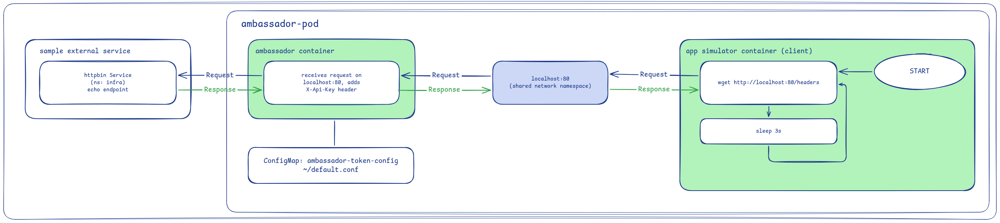

In the ambassador pattern, the app container is the client that initiates the request. It only ever talks to localhost, unaware of what is actually handling the connection or where the request ends up. An ambassador does not have to just forward bytes unchanged either, it can also modify the request on the way out.

