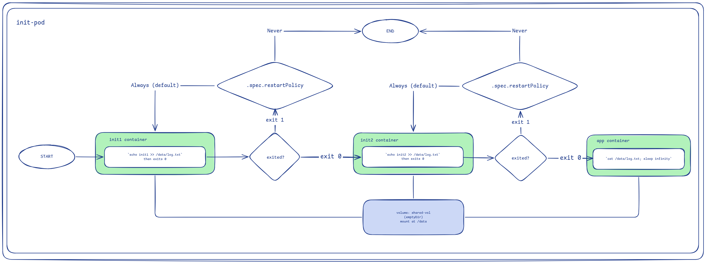

Init containers run in sequential order. Each one must exit 0 before the next one starts. Once every init container has exited, the main containers start. This makes them suited to one-time setup work: pulling configs, rendering templates, etc.

