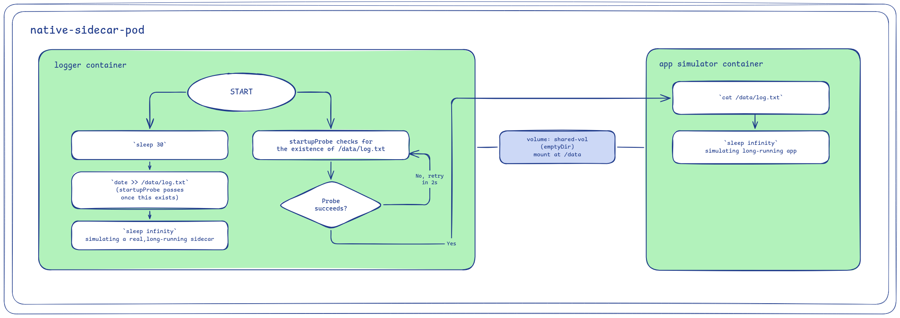

A sidecar container starts at the same time as the main container, with no guarantee it is ready first. A plain init container guarantees order, but it must exit before the main containers start, so it cannot keep running as an ongoing capability like a proxy or log shipper needs to. Adding restartPolicy: Always on the container itself (.spec.initContainers[].restartPolicy, not the Pod's .spec.restartPolicy) and a startupProbe to an initContainers entry changes that behavior: kubelet waits for the probe to pass, not for the container to exit, before starting the main containers. That combination is a native sidecar: the ordering guarantee of an init container, with the lifespan of a sidecar.

