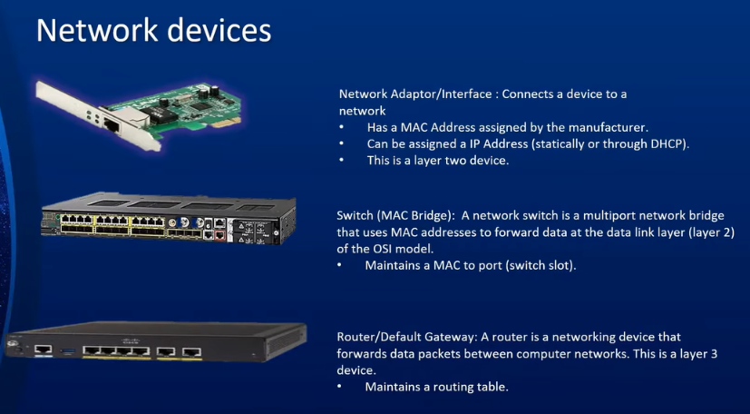
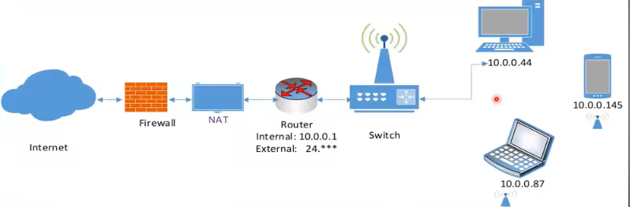
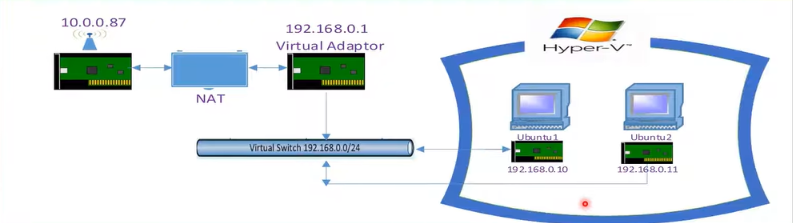
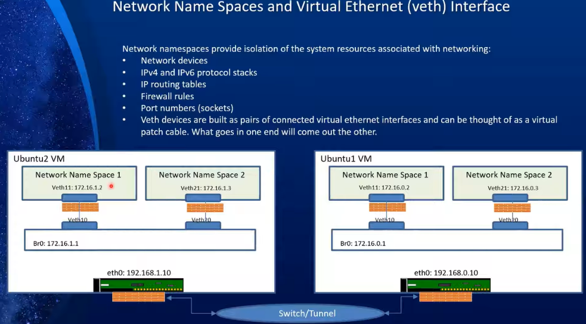
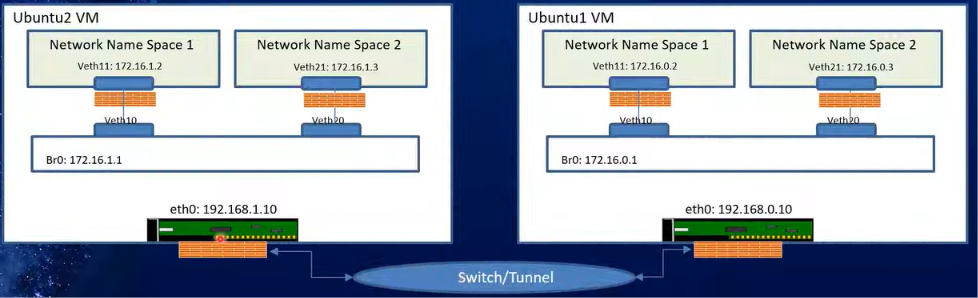
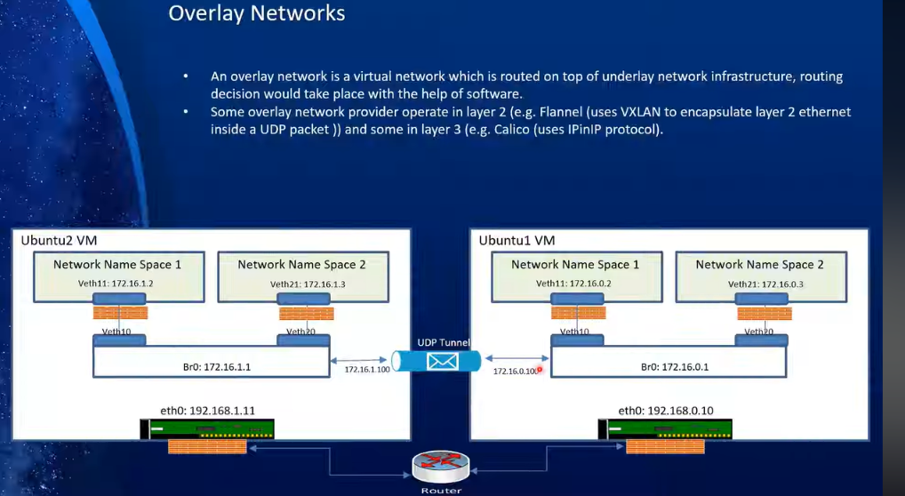
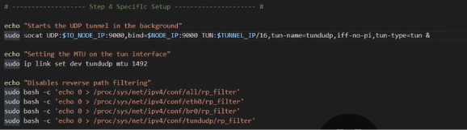
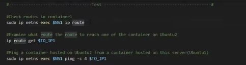
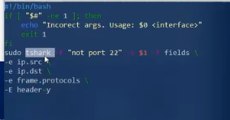

# Kubernetes & Container Networking — Detailed Notes

## 1. Kubernetes Networking Overview
Kubernetes is heavily dependent on networking. To manage applications and write apps for Kubernetes, you must understand how networking works inside the cluster.

There are **three types of networks** in Kubernetes:

1. **Node network**
   - How master and worker nodes are connected.
   - What subnets/IPs they use.
   - Foundational: if node networking is broken, Kubernetes cannot work.
   - Kubernetes manipulates IP routing on master/worker nodes to enable communication between pods and services.

2. **Cluster network**
   - Provides connectivity to services from inside and outside the cluster.
   - The main way to expose services running inside pods.
   - Service networking, service IPs, load balancing, external access.

3. **Pod network**
   - Provides network connectivity between pods on the same node or different nodes.
   - Also allows pods to consume services.
   - Most fundamental and often most complex part of Kubernetes networking.

**Agenda from the talk:**
- Start with pod networking.
- Review basic networking constructs: OSI model, devices, namespaces, virtual networks.
- Simulate container networking using VMs, namespaces, veth pairs, bridges, routes.
- Later move to overlay networks such as Flannel and Calico.

---

## 2. OSI Model Review
OSI = **Open Systems Interconnect**. Defined in the 1970s to standardize communication between different computer and telecom systems.

Originally 7 layers; modern focus is on **5 important layers**.

| Layer | Name | Protocol Examples | Data Unit | Addressing |
|---|---|---|---|---|
| 1 | Physical | 10BaseT, 802.11 | Bits | None |
| 2 | Data Link | Ethernet, Wi-Fi | Frames | MAC address |
| 3 | Network | IP | Datagram / Packet | IP address |
| 4 | Transport | TCP, UDP | Segment | Port |
| 5 | Application | HTTP, SMTP | Message | None |

### Layer Details
- **Layer 1 – Physical**
  - The actual medium: fiber, twisted pair, coax, wireless.
  - Protocols like 10BaseT, 802.11.
  - Data unit: bits.
  - No addressing scheme.

- **Layer 2 – Data Link**
  - Protocol: Ethernet or Wi-Fi.
  - Data unit: frames.
  - Addressing: MAC address.
  - Point-to-point: only one hop/hub at a time.
  - Used within the same subnet.

- **Layer 3 – Network**
  - Protocol: IP.
  - Data unit: datagram/packet.
  - Addressing: IP address.
  - Helps Ethernet frames travel from source to destination across multiple networks/hops.
  - Routers operate here.

- **Layer 4 – Transport**
  - Protocols: TCP, UDP.
  - Data unit: segment.
  - Addressing: port numbers.
  - Services are reachable through ports.

- **Layer 5 – Application**
  - Protocols: HTTP, SMTP, etc.
  - Data unit: message.
  - No addressing.
  - Format agreed between sender and receiver.

### Analogy: Sending Physical Mail
- **Application layer** = language/format of the letter.
- **Physical layer** = roads/highways connecting houses.
- **Data link layer** = postal truck carrying the letter.
- **Frame** = envelope containing the letter and physical address.
- **Network layer** = address and routing between cities.
- **Transport port** = mailbox at the destination.

**Important:** TCP/IP is often lumped together, but layers are distinct. CNI providers like Calico and Flannel operate at Layer 2 or Layer 3.

---

## 3. Common Network Devices
### Network Adapter / NIC
- Connects a device to a network.
- Has a MAC address assigned by the manufacturer.
- Can also have an IP address assigned.
- Operates at Layer 2.
- Connects Layer 1 to Layer 2.

### Switch
- Also called a MAC bridge.
- Multi-port network bridge.
- Uses MAC addresses to forward data at Layer 2.
- Maintains a MAC-to-port table.
- Used for communication within the same subnet.
- No IP involved when devices communicate inside the same subnet.

### Router / Default Gateway
- Forwards data packets between different computer networks.
- Operates at Layer 3.
- Maintains a routing table.
- Default gateway is a router.
- Used when traffic leaves the local subnet.

### Virtual Versions
- Virtual NICs, virtual switches, and virtual routers exist.
- Used heavily in VMs and containers.
- VMs do not exist outside their host, so their network adapters and bridges are virtualized.



---

## 4. Physical Network Example
Example: home network with a switch and wireless access point.
- Devices on the same subnet communicate through the switch using Ethernet frames and MAC addresses at Layer 2.
- When a device wants to reach the internet:
  - Request goes to the switch, then to the router.
  - Router has an internal IP and an external/public IP.
  - Router connects different networks because it has at least two interfaces.
  - Router performs **NAT (Network Address Translation)**.
- Private IP ranges: `10.0.0.0/8`, `192.168.0.0/16`, `172.16.0.0/12`.
- NAT changes the source private IP to the router’s public IP.
- On response, NAT reverses the mapping and sends the packet back to the original device.



**Summary:**
- Local communication = Ethernet/MAC at Layer 2.
- External communication = IP/routing at Layer 3.

---

## 5. Virtual Networking in VMs
Example: Host machine running Hyper-V with two Ubuntu VMs.
- Each VM has a virtual NIC.
- A virtual switch/bridge connects the VMs.
- The host can have:
  - A physical adapter, e.g., `10.0.0.87`.
  - A virtual adapter, e.g., `192.168.0.1`.
- The host can act as a router between the virtual network and physical network.
- When a VM contacts a service on the host:
  - Traffic goes through the virtual switch.
  - Host adapter acts as router/NAT.
  - Source IP is changed from `192.168.0.10` to `10.0.0.87`.
  - Response is translated back.



This same idea applies to containers.

---

## 6. Network Namespaces and veth
### Network Namespace
- Provides isolation of networking resources within a host.
- Each namespace has its own:
  - Network devices: adapters, bridges, etc.
  - IPv4 and IPv6 protocol stacks.
  - IP routing table.
  - Firewall rules.
  - Port numbers.
- Containers are created inside network namespaces.
- Namespaces are a fundamental building block for container networking.

### veth (Virtual Ethernet) Interface
- veth interfaces are created as **pairs** of connected virtual interfaces.
- Can be thought of as a virtual patch cable.
- What goes in one end comes out the other.
- Used to connect a container/namespace to a bridge or host.



---

## 7. Lab: Simulating Container Networking
Goal: Create two VMs, each with namespaces/containers, veth pairs, bridges, and routes. Then connect them.

Connectivity between the two VMs by first relying on the fact that both VMs were on the same subnet, so they could reach each other directly through a Hyper‑V virtual switch.

This mimics how Docker sets up connectivity between containers.

### Basic Topology
- Two Ubuntu VMs: `ubuntu1`, `ubuntu2`.
- Each VM has network namespaces treated as containers.
- Each namespace has a veth pair.
- One end of veth is inside the namespace.
- The other end is connected to a bridge.
- Bridges connect namespaces to other devices.
- If VMs are on the same subnet, use a switch.
- If VMs are on different subnets, use a tunnel/overlay.




---

### Example Variables

```bash
NS1="NS1"
NS2="NS2"

SERVER_ONE_IP="192.168.56.11"
SERVER_TWO_IP="192.168.56.12"

NODE_ONE_BRIDGE_SUBNET="172.16.0.0/24"
NODE_TWO_BRIDGE_SUBNET="172.16.1.0/24"

NODE_ONE_BRIDGE_IP="172.16.0.1"
NODE_TWO_BRIDGE_IP="172.16.1.1"

NODE_ONE_NS1_IP="172.16.0.2"
NODE_ONE_NS2_IP="172.16.0.3"

NODE_TWO_NS1_IP="172.16.1.2"
NODE_TWO_NS2_IP="172.16.1.3"
```

---

### Commands on server1

Create namespaces:
```bash
sudo ip netns add $NS1
sudo ip netns add $NS2
ip netns show
```

Create veth pairs:
```bash
sudo ip link add veth10 type veth peer name veth11
sudo ip link add veth20 type veth peer name veth21
ip link show type veth
ip link show veth11
ip link show veth20
```

Attach one end of veth pair to a namespace:
```bash
sudo ip link set veth11 netns $NS1
sudo ip link set veth21 netns $NS2
```

Assign IP addresses to the interfaces inside network namespaces:
```bash
sudo ip netns exec $NS1 ip addr add $NODE_ONE_NS1_IP/24 dev veth11
sudo ip netns exec $NS2 ip addr add $NODE_ONE_NS2_IP/24 dev veth21
```

Enabling the interfaces inside the network namespaces:
```bash
sudo ip netns exec $NS1 ip link set dev veth11 up
sudo ip netns exec $NS2 ip link set dev veth21 up
```

Create bridge:
```bash
sudo ip link add br0 type bridge
sudo ip link show type bridge
sudo ip link show br0
sudo ip link delete br0
```

Attach host-side veth network namespace side interface to bridge:
```bash
sudo ip link set veth10 master br0
sudo ip link set veth20 master br0
```

Assigning the IP address to the bridge:
```bash
sudo ip addr add $NODE_ONE_BRIDGE_SUBNET dev br0
```

Bring bridge up:
```bash
# Enabling the bridge
sudo ip link set dev br0 up

# Enabling the interfaces connected to the bridge
sudo ip link set veth10 up
sudo ip link set veth20 up
```

Enable loopback inside namespaces:
```bash
sudo ip netns exec $NS1 ip link set lo up
sudo ip netns exec $NS2 ip link set lo up
```
```bash
sudo ip netns exec $NS1 ip a
sudo ip netns exec $NS2 ip a
```

Set default route inside network namespace:
```bash
sudo ip netns exec $NS1 ip route add default via $NODE_ONE_BRIDGE_IP dev veth11
sudo ip netns exec $NS2 ip route add default via $NODE_ONE_BRIDGE_IP dev veth21
```
```bash
sudo ip netns exec $NS1 ip route 
sudo ip netns exec $NS2 ip route
```

Add route to the other side:
```bash
# sudo ip route add <remote-bridge-subnet> via <remote-ip> dev <interface>
sudo ip route add $NODE_TWO_BRIDGE_SUBNET via $SERVER_TWO_IP dev enp0s8
```

Enable IP forwarding: For the VM to forward packets between its bridge subnet and its external NIC, IP forwarding must be enabled.
```bash
sudo sysctl -w net.ipv4.ip_forward=1
```
Now each VM acts like a router between:
  - its internal bridge network, and
  - the external VM network.

---

### Commands on server2

Create namespaces:
```bash
sudo ip netns add $NS1
sudo ip netns add $NS2
ip netns show
```

Create veth pairs:
```bash
sudo ip link add veth10 type veth peer name veth11
sudo ip link add veth20 type veth peer name veth21
ip link show type veth
ip link show veth11
ip link show veth20
```

Attach one end of veth pair to a namespace:
```bash
sudo ip link set veth11 netns $NS1
sudo ip link set veth21 netns $NS2
```

Assign IP addresses to the interfaces inside network namespaces:
```bash
sudo ip netns exec $NS1 ip addr add $NODE_TWO_NS1_IP/24 dev veth11
sudo ip netns exec $NS2 ip addr add $NODE_TWO_NS2_IP/24 dev veth21
```

Enabling the interfaces inside the network namespaces:
```bash
sudo ip netns exec $NS1 ip link set dev veth11 up
sudo ip netns exec $NS2 ip link set dev veth21 up
```

Create bridge:
```bash
sudo ip link add br0 type bridge
sudo ip link show type bridge
sudo ip link show br0
sudo ip link delete br0
```

Attach host-side veth network namespace side interface to bridge:
```bash
sudo ip link set veth10 master br0
sudo ip link set veth20 master br0
```

Assigning the IP address to the bridge:
```bash
sudo ip addr add $NODE_TWO_BRIDGE_SUBNET dev br0
```

Bring bridge up:
```bash
# Enabling the bridge
sudo ip link set dev br0 up

# Enabling the interfaces connected to the bridge
sudo ip link set veth10 up
sudo ip link set veth20 up
```

Enable loopback inside namespaces:
```bash
sudo ip netns exec $NS1 ip link set lo up
sudo ip netns exec $NS2 ip link set lo up
```
```bash
sudo ip netns exec $NS1 ip a
sudo ip netns exec $NS2 ip a
```

Set default route inside network namespace:
```bash
sudo ip netns exec $NS1 ip route add default via $NODE_TWO_BRIDGE_IP dev veth11
sudo ip netns exec $NS2 ip route add default via $NODE_TWO_BRIDGE_IP dev veth21
```
```bash
sudo ip netns exec $NS1 ip route 
sudo ip netns exec $NS2 ip route
```

Add route to the other side:
```bash
# sudo ip route add <remote-bridge-subnet> via <remote-ip> dev <interface>
sudo ip route add $NODE_ONE_BRIDGE_SUBNET via $SERVER_ONE_IP dev enp0s8
```

Enable IP forwarding: For the VM to forward packets between its bridge subnet and its external NIC, IP forwarding must be enabled.
```bash
sudo sysctl -w net.ipv4.ip_forward=1
```
Now each VM acts like a router between:
  - its internal bridge network, and
  - the external VM network.

---

### Testing
- Ping from `ns1` to `ns2`.
- Ping from namespace to bridge.
- Ping from namespace to the other server.
- Ping from namespace to the remote bridge.
- Ping from namespace to remote veth.
- If routing and forwarding are correct, all should succeed.


##### Server1

```bash
# -------------------- Tests --------------------

# Ping adapter attached to NS1
sudo ip netns exec $NS1 ping -W 1 -c 2 172.16.0.2

# Ping the bridge
sudo ip netns exec $NS1 ping -W 1 -c 2 172.16.0.1

# Ping the adapter of the second container
sudo ip netns exec $NS1 ping -W 1 -c 2 172.16.0.3

# Ping the server1
sudo ip netns exec $NS1 ping -W 1 -c 2 192.168.56.11

# Ping the server2
sudo ip netns exec $NS1 ping -W 1 -c 2 192.168.56.12

# Ping the bridge server2
sudo ip netns exec $NS1 ping -W 1 -c 2 172.16.1.1

# Ping the first container on server2
sudo ip netns exec $NS1 ping -W 1 -c 2 172.16.1.2

# Ping the second container on server2
sudo ip netns exec $NS1 ping -W 1 -c 2 172.16.1.3
```

##### Server2

```bash
# -------------------- Tests --------------------

# Ping adapter attached to NS1
sudo ip netns exec $NS1 ping -W 1 -c 2 172.16.1.2

# Ping the bridge
sudo ip netns exec $NS1 ping -W 1 -c 2 172.16.1.1

# Ping the adapter of the second container
sudo ip netns exec $NS1 ping -W 1 -c 2 172.16.1.3

# Ping the server2
sudo ip netns exec $NS1 ping -W 1 -c 2 192.168.56.12

# Ping the server1
sudo ip netns exec $NS1 ping -W 1 -c 2 192.168.56.11

# Ping the bridge server1
sudo ip netns exec $NS1 ping -W 1 -c 2 172.16.0.1

# Ping the first container on server1
sudo ip netns exec $NS1 ping -W 1 -c 2 172.16.0.2

# Ping the second container on server1
sudo ip netns exec $NS1 ping -W 1 -c 2 172.16.0.3
```

---

### Resulting Traffic Path

```bash
ns1 on ubuntu1
  → veth11
  → br0 on ubuntu1
  → ubuntu1 routing / IP forwarding
  → ubuntu1 NIC (192.168.0.10)
  → Hyper-V virtual switch
  → ubuntu2 NIC (192.168.0.11)
  → ubuntu2 routing / IP forwarding
  → br0 on ubuntu2
  → veth11 on ubuntu2
  → ns1 on ubuntu2
```

---

## 8. Overlay Networks and Tunnels
When two servers are on different subnets, simple route manipulation is not enough. You need an **overlay network**.



### What Is an Overlay Network?
- A virtual network sitting on top of the underlying physical network.
- Provides connectivity between virtual environments like containers on different servers.
- Used extensively in Docker and Kubernetes.

### Types of Overlay Networks
- **Layer 2 overlay**
  - Example: Flannel.
  - Uses VXLAN.
  - Encapsulates Layer 2 Ethernet inside UDP packets.
- **Layer 3 overlay**
  - Example: Calico.
  - Encapsulates IP packets inside another IP packet.
  - Routes the encapsulated packet to a different server.

---

### UDP Tunnel Example
- Two servers on different subnets, with a router between them.
- Set up a UDP tunnel between the two servers.
- Tunnel endpoints:
  - One side: `172.16.0.100`.
  - Other side: `172.16.1.100`.
- The bridge connects into the tunnel.
- Communication is encapsulated inside UDP datagrams.

- Every thing from the previous setup would be same till the ip forwarding enabled.

---

### Example Variables

```bash
NS1="NS1"
NS2="NS2"

SERVER_ONE_IP="192.168.56.11"
SERVER_TWO_IP="192.168.57.11"

NODE_ONE_BRIDGE_SUBNET="172.16.0.0/24"
NODE_TWO_BRIDGE_SUBNET="172.16.1.0/24"

NODE_ONE_BRIDGE_IP="172.16.0.1"
NODE_TWO_BRIDGE_IP="172.16.1.1"

NODE_ONE_NS1_IP="172.16.0.2"
NODE_ONE_NS2_IP="172.16.0.3"

NODE_TWO_NS1_IP="172.16.1.2"
NODE_TWO_NS2_IP="172.16.1.3"

NODE_ONE_TUNNEL_IP="172.16.0.100"
NODE_TWO_TUNNEL_IP="172.16.1.100"
```

---

### Commands on server1

Create namespaces:
```bash
sudo ip netns add $NS1
sudo ip netns add $NS2
ip netns show
```

Create veth pairs:
```bash
sudo ip link add veth10 type veth peer name veth11
sudo ip link add veth20 type veth peer name veth21
ip link show type veth
ip link show veth11
ip link show veth20
```

Attach one end of veth pair to a namespace:
```bash
sudo ip link set veth11 netns $NS1
sudo ip link set veth21 netns $NS2
```

Assign IP addresses to the interfaces inside network namespaces:
```bash
sudo ip netns exec $NS1 ip addr add $NODE_ONE_NS1_IP/24 dev veth11
sudo ip netns exec $NS2 ip addr add $NODE_ONE_NS2_IP/24 dev veth21
```

Enabling the interfaces inside the network namespaces:
```bash
sudo ip netns exec $NS1 ip link set dev veth11 up
sudo ip netns exec $NS2 ip link set dev veth21 up
```

Create bridge:
```bash
sudo ip link add br0 type bridge
sudo ip link show type bridge
sudo ip link show br0
```
```bash
sudo ip link delete br0
```

Attach host-side veth network namespace side interface to bridge:
```bash
sudo ip link set veth10 master br0
sudo ip link set veth20 master br0
```

Assigning the IP address to the bridge:
```bash
sudo ip addr add $NODE_ONE_BRIDGE_SUBNET dev br0
```

Bring bridge up:
```bash
# Enabling the bridge
sudo ip link set dev br0 up

# Enabling the interfaces connected to the bridge
sudo ip link set veth10 up
sudo ip link set veth20 up
```

Enable loopback inside namespaces:
```bash
sudo ip netns exec $NS1 ip link set lo up
sudo ip netns exec $NS2 ip link set lo up
```
```bash
sudo ip netns exec $NS1 ip a
sudo ip netns exec $NS2 ip a
```

Set default route inside network namespace:
```bash
sudo ip netns exec $NS1 ip route add default via $NODE_ONE_BRIDGE_IP dev veth11
sudo ip netns exec $NS2 ip route add default via $NODE_ONE_BRIDGE_IP dev veth21
```
```bash
sudo ip netns exec $NS1 ip route 
sudo ip netns exec $NS2 ip route
```

Add route to the other side:
```bash
# sudo ip route add <remote-bridge-subnet> via <remote-ip> dev <interface>
sudo ip route add $NODE_TWO_BRIDGE_SUBNET via $SERVER_TWO_IP dev enp0s8
```

Enable IP forwarding: For the VM to forward packets between its bridge subnet and its external NIC, IP forwarding must be enabled.
```bash
sudo sysctl -w net.ipv4.ip_forward=1
```
Now each VM acts like a router between:
  - its internal bridge network, and
  - the external VM network.

---

### Commands on server2

Create namespaces:
```bash
sudo ip netns add $NS1
sudo ip netns add $NS2
ip netns show
```

Create veth pairs:
```bash
sudo ip link add veth10 type veth peer name veth11
sudo ip link add veth20 type veth peer name veth21
ip link show type veth
ip link show veth11
ip link show veth20
```

Attach one end of veth pair to a namespace:
```bash
sudo ip link set veth11 netns $NS1
sudo ip link set veth21 netns $NS2
```

Assign IP addresses to the interfaces inside network namespaces:
```bash
sudo ip netns exec $NS1 ip addr add $NODE_TWO_NS1_IP/24 dev veth11
sudo ip netns exec $NS2 ip addr add $NODE_TWO_NS2_IP/24 dev veth21
```

Enabling the interfaces inside the network namespaces:
```bash
sudo ip netns exec $NS1 ip link set dev veth11 up
sudo ip netns exec $NS2 ip link set dev veth21 up
```

Create bridge:
```bash
sudo ip link add br0 type bridge
sudo ip link show type bridge
sudo ip link show br0
sudo ip link delete br0
```

Attach host-side veth network namespace side interface to bridge:
```bash
sudo ip link set veth10 master br0
sudo ip link set veth20 master br0
```

Assigning the IP address to the bridge:
```bash
sudo ip addr add $NODE_TWO_BRIDGE_SUBNET dev br0
```

Bring bridge up:
```bash
# Enabling the bridge
sudo ip link set dev br0 up

# Enabling the interfaces connected to the bridge
sudo ip link set veth10 up
sudo ip link set veth20 up
```

Enable loopback inside namespaces:
```bash
sudo ip netns exec $NS1 ip link set lo up
sudo ip netns exec $NS2 ip link set lo up
```
```bash
sudo ip netns exec $NS1 ip a
sudo ip netns exec $NS2 ip a
```

Set default route inside network namespace:
```bash
sudo ip netns exec $NS1 ip route add default via $NODE_TWO_BRIDGE_IP dev veth11
sudo ip netns exec $NS2 ip route add default via $NODE_TWO_BRIDGE_IP dev veth21
```
```bash
sudo ip netns exec $NS1 ip route 
sudo ip netns exec $NS2 ip route
```

Add route to the other side:
```bash
# sudo ip route add <remote-bridge-subnet> via <remote-ip> dev <interface>
sudo ip route add $NODE_ONE_BRIDGE_SUBNET via $SERVER_ONE_IP dev enp0s8
```

Enable IP forwarding: For the VM to forward packets between its bridge subnet and its external NIC, IP forwarding must be enabled.
```bash
sudo sysctl -w net.ipv4.ip_forward=1
```
Now each VM acts like a router between:
  - its internal bridge network, and
  - the external VM network.

---

### Using `socat`
- `socat` is a powerful utility for bidirectional connectivity between data sources.
- Supports UDP, TCP, sockets, SSL, files, etc.
- Example: establish UDP between two IPs on port `9000`.
- Create a tunnel:
  - Name it `tun0` or similar.
  - Type `tun` for Layer 3.
  - Type `tap` for Layer 2.
- Run `socat` on both sides; both listen on port `9000`.



### Route Check
```bash
sudo ip netns exec ns1 ip route get 172.16.1.2
```
This shows how packets travel:
- From namespace → bridge → veth → tunnel IP `172.16.0.100` → through tunnel → other side → destination.



### Testing Overlay
- Ping from one container to another across the tunnel.
- If successful, overlay connectivity works.

### Monitoring with `tshark`
- `tshark` is the command-line version of Wireshark.
- Used to capture and inspect network traffic.
- Example script:
```bash
sudo tshark not port 22
```
- Can observe ICMP ping packets between tunnel endpoints.
- Useful for future Kubernetes overlay networks like Calico and Flannel.



---

## 9. Key Takeaways
- Kubernetes has three network layers: node, cluster, pod.
- Pod networking is fundamental and complex.
- OSI model helps understand where protocols and devices operate.
- Layer 2 = MAC/frames/switches.
- Layer 3 = IP/packets/routers.
- Layer 4 = TCP/UDP/ports.
- Network namespaces and veth pairs are the foundation of container networking.
- Bridges connect namespaces/containers to each other and to the host.
- Routes and IP forwarding enable communication between namespaces and servers.
- NAT allows private IPs to reach external networks.
- When servers are on different subnets, use overlay networks/tunnels.
- Flannel and Calico are common Kubernetes CNI providers using overlay concepts.
- Tools: `ip netns`, `ip link`, `ip addr`, `ip route`, `sysctl`, `socat`, `tshark`.

---

## 10. Transcript Terms / Typos to Note
- “grenada’s networking” → Kubernetes networking.
- “ortonois” → worker nodes.
- “ipad” → IP address.
- “red” / “width” → veth / virtual Ethernet.
- “tan” → tun.
- “socad” → socat.
- “t-shark” → tshark.
- “by cmp” → ICMP.
- “app” → up.
- “rod” → route.
- “rotting table” → routing table.

