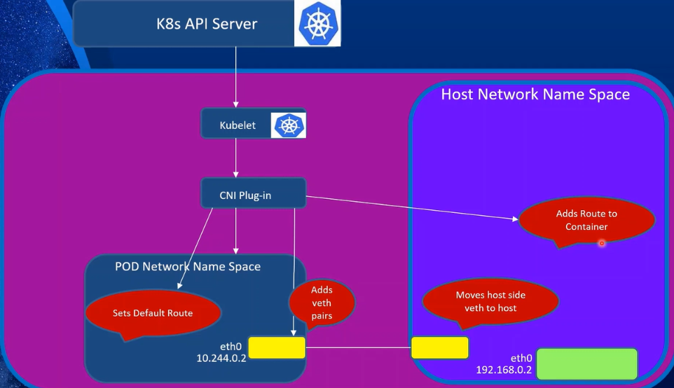
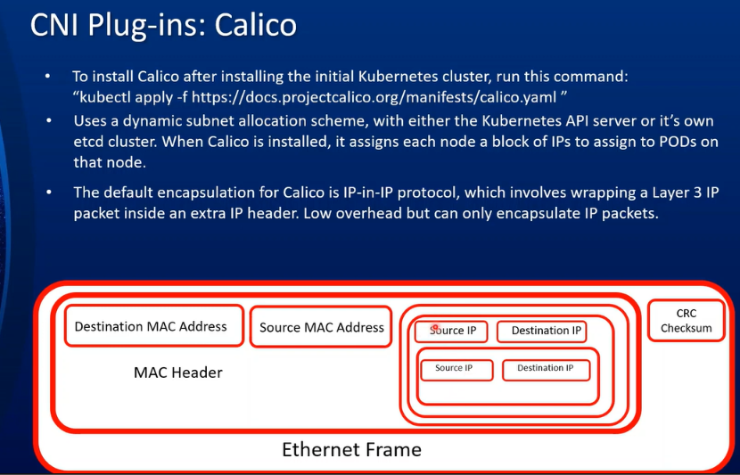
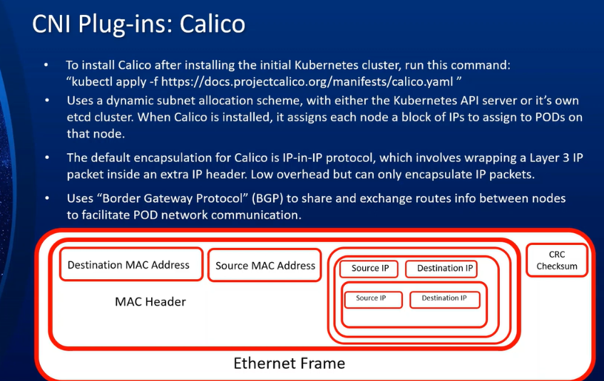
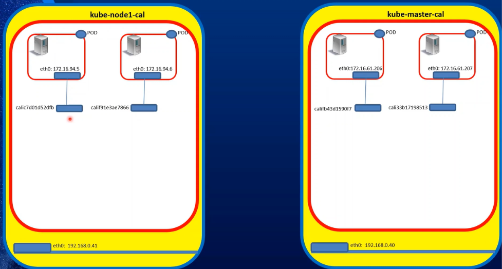

# Kubernetes Networking Part 3 — CNI, Calico, IP-in-IP, and BGP — Detailed Notes

## 1. CNI Overview

**CNI = Container Network Interface**
- Open-source software that provides **network plumbing for containers**.
- As containers became popular, every tool had to repeatedly:
  - Set up networking.
  - Assign IP addresses.
  - Configure routes.
  - Clean up networking resources.
- CNI standardizes this so tools like:
  - Kubernetes
  - Cloud Foundry
  - Podman
  - CRI-O
  can all use the same CNI plugins.

### How CNI Works Graphically
On a Kubernetes node:
1. API server calls **kubelet**.
2. Kubelet calls the **CNI plugin**.
3. CNI plugin creates a **pod network namespace**.
4. It creates a **veth pair**:
   - One end inside the pod namespace.
   - One end attached to the host.
5. It assigns an IP address to the pod.
6. It sets the default route inside the pod.
7. It adds routes on the host so the pod can communicate.
8. Result: host ↔ pod communication is established.



---

## 2. Calico CNI Overview

Calico is a very popular CNI plugin provider.

### Installation
After setting up a Kubernetes cluster:
```bash
kubectl apply -f <calico-install-url>
```

### IP Allocation
- Calico uses **dynamic subnet allocation**.
- It can use:
  - Kubernetes API server, or
  - Its own etcd.
- It assigns a **block of IPs to each node**.
- Each node then assigns IPs to pods created on it.

### Default Encapsulation
- Calico’s default encapsulation is **IP-in-IP**.
- IP-in-IP wraps a Layer 3 IP packet inside another IP header.
- Used mainly for **cross-node pod communication**.
- Same-node pod communication does not need IP-in-IP.



---

## 3. IP-in-IP Encapsulation

### Packet Structure
Outer Ethernet frame:
- Source MAC: originating server.
- Destination MAC: destination server.

Outer IP header:
- Source IP: originating node IP.
- Destination IP: destination node IP.
- Protocol: IP-in-IP.

Inner IP packet:
- Source IP: source pod IP.
- Destination IP: destination pod IP.

Inner TCP/UDP and application data.

### Key Idea
- The pod-to-pod IP packet is **piggybacked** inside another IP packet.
- The outer IP header handles node-to-node routing.
- The inner IP header identifies the actual pods.
- The destination node unpacks the outer header and forwards the inner packet to the correct pod.

### When It Is Used
- Only when pods communicate **across nodes**.
- Same-node pod traffic uses local routes and veth interfaces.



---

## 4. Calico Demo — Interfaces and Routes

### Setup
- Two-node Kubernetes cluster: `master` and `node1`.
- Hello-world application with 4 pods:
  - 2 pods on `master`.
  - 2 pods on `node1`.



### Verify Interfaces
```bash
ip addr
```
Shows:
- Loopback.
- Unused interfaces like `vibro`, `docker`.
- Calico interfaces such as `cali...`.
- `tunnel0` — IP-in-IP tunnel interface.

```bash
ip link show type veth
```
Shows veth pairs created for pods.

```bash
ip link show type ipip
```
Shows `tunnel0` as an IP-in-IP tunnel.

### Verify Pods
```bash
kubectl get pods -o wide
```
Shows:
- Pod names.
- Nodes.
- Pod IP addresses.
- 4 pods total, 2 per node.

### Check Routes to Pods
```bash
ip route get <pod-ip>
```

- For a pod on the **same node**:
  - Route goes through the Calico veth interface connecting host to pod.
- For a pod on a **different node**:
  - Route goes through `tunnel0`.
  - `tunnel0` has an IP such as `172.16.94.0`.
  - This tunnel performs IP-in-IP encapsulation.

### Graphical Summary
- Same-node pod traffic → veth pair → pod.
- Cross-node pod traffic → tunnel0 → IP-in-IP → remote node → remote pod.
- The tunnel masquerades the source as the tunnel IP and sends the packet to the remote node.

---

## 5. Packet Capture with `tshark` — IP-in-IP in Action

### Command
```bash
tshark -i eth0 -v -Y http
```
- `-i eth0`: capture on interface `eth0`.
- `-v`: verbose output.
- `-Y http`: filter HTTP traffic.

### Observed Packet Layers
1. **Outer Ethernet frame**
   - Source MAC: node1.
   - Destination MAC: master.

2. **Outer IP header**
   - Source IP: `192.168.0.41` (node1).
   - Destination IP: `192.168.0.4` (master).
   - Protocol: `ipip`.

3. **Inner IP header**
   - Source IP: `172.16.94.0` — Calico tunnel IP, masquerading the source pod.
   - Destination IP: target pod IP, e.g., `172.16.206...`.
   - This is the actual pod-to-pod communication.

4. **TCP header**
   - Destination port: `8080`.
   - HTTP handshake and data.

5. **Response path**
   - Reverse process.
   - Remote pod responds.
   - Packet is encapsulated again in IP-in-IP.
   - Sent back to the calling node and pod.

### Key Point
- IP-in-IP is transparent to the application.
- It adds overhead but simplifies cross-node pod communication.

---

## 6. BGP — Border Gateway Protocol

### What Is BGP?
- Standardized **exterior gateway protocol**.
- Designed to exchange routing and reachability information among **autonomous systems** on the internet.
- The internet largely runs on BGP.

### Two Main Functions
1. **Who can I send packets to?**
   - Which routers/networks are reachable.
2. **Which route should the packet take?**
   - Best path selection.

### How BGP Works — Simple Example
- Four networks A, B, C, D.
- Initially each network only knows its own routes.
- Administrators configure BGP peering between networks.
- A peers with B → A and B learn each other’s routes.
- A peers with C → A and C learn each other’s routes.
- C peers with D → C and D learn each other’s routes.
- Periodically, networks share route information.
- B learns from A how to reach C.
- D learns from B how to reach A.
- Eventually all networks know how to reach each other, with hop counts.

### How Calico Uses BGP
- Calico uses BGP to share routes between Kubernetes nodes.
- By default, Calico creates a **full mesh** of internal BGP connections:
  - Every node peers with every other node.
  - Route changes on one node are reflected immediately on all others.
- If all nodes are on the same L2 subnet, Calico can use L2.
- If nodes are on different subnets, Calico can use IP-in-IP over L3.
- If IP-in-IP is blocked, VXLAN can be used — but BGP is not supported in that scenario.

### Scaling BGP
- Full mesh works well for small clusters.
- For larger clusters, full mesh becomes impractical.
- Calico supports **route reflectors**:
  - Select a few nodes.
  - Establish full mesh among them.
  - Other nodes peer with route reflectors.
  - Route reflectors propagate changes to their peers.
- On-prem with control over hardware:
  - Disable full mesh.
  - Peer Calico with **Top-of-Rack (ToR)** routers.
  - Benefits: no encapsulation, pod IPs routable outside the cluster.

---

## 7. Calico Processes: Felix and Bird

When Calico is installed, it runs two important daemons:

### Felix
- Manages and programs the **route table**.
- When a new pod is created:
  - CNI plugin creates netns and veth.
  - Felix adds a route for the new pod IP.
  - If the pod is on the same node, route goes through the Calico interface.
  - If the pod is on another node, route goes through `tunnel0`.

### Bird
- A **BGP agent**.
- Talks to Bird on other nodes.
- Exchanges routing information.
- When a new route is added on one node:
  - Felix programs the local route.
  - Bird advertises the route via BGP.
  - Remote Bird receives it.
  - Remote Felix programs the route on the remote node.

### Workflow Summary
```text
Deploy pod
  → API server → kubelet → CNI plugin
  → create netns, veth, IP, default route
  → Felix programs local route
  → Bird advertises route via BGP
  → remote Bird receives route
  → remote Felix programs route
  → cross-node pod communication works
```

---

## 8. Calico Networking Options

### 1. Non-Overlay Network
- Most performant: no encapsulation/decapsulation.
- Two sub-options:
  - **BGP peer with ToR routers**:
    - No encapsulation.
    - Pod IPs routable from outside the cluster.
  - **BGP peering among nodes on same L2 subnet**:
    - No encapsulation.
    - Pod IPs not routable from outside the cluster.
    - Still high performance.

### 2. Cross-Subnet Overlay
- Best of both worlds:
  - Same subnet → no encapsulation.
  - Different subnet → IP-in-IP or VXLAN.
- Useful when nodes span multiple subnets.

### 3. Full Overlay Network
- Used when non-overlay is not possible.
- Options:
  - IP-in-IP (Calico default).
  - VXLAN (similar to Flannel).
- Adds overhead but works across subnets.

### Cloud Notes
- Azure does **not** support IP-in-IP.
- If overlay is required in Azure, use VXLAN.
- Other clouds have their own nuances.
- Always check Calico documentation for cloud-specific guidance.

---

## 9. Changing Calico Network Settings After Install

### Install `calicoctl`
- CLI for interacting with Calico.
- Link usually provided in the video description.

### Check BGP Status
```bash
calicoctl node status
```
Shows:
- Peer address.
- Peer type: node-to-node mesh.
- Status: up / established.

### View IP Pools
```bash
calicoctl get ippool -o yaml > ippool.yaml
```
- Shows default IP pool, e.g., `172.16.0.0/16`.
- Each node gets a block, e.g., `/26`.
- `ipipMode: Always` by default.
- `vxlanMode: Never` by default.

### Disable IP-in-IP
Edit `ippool.yaml`:
```yaml
ipipMode: Never
```
Then apply:
```bash
calicoctl apply -f ippool.yaml
```

### Verify Route Change
```bash
watch ip route
```
- Before: cross-node traffic goes through `tunnel0`.
- After: cross-node traffic goes through the regular interface.
- No more IP-in-IP encapsulation.

### Verify with Packet Capture
- Run `tshark` again.
- Observe:
  - No outer IP-in-IP header.
  - Only one IP header.
  - Direct routing between nodes.
- This is faster because no encapsulation/decapsulation.

---

## 10. Summary of the Video

Topics covered:
- Container Network Interface (CNI).
- Project Calico as a CNI provider.
- IP-in-IP protocol and how Calico uses it.
- Border Gateway Protocol (BGP) and how Calico leverages it.
- Calico processes: Felix and Bird.
- Calico networking options:
  - Non-overlay.
  - Cross-subnet overlay.
  - Full overlay.
- How to change Calico network settings after installation.
- Packet capture demonstrations with `tshark`.

---

## 11. Transcript Terms / Typos to Note

| Transcript Term | Correct Term |
|---|---|
| cni | CNI |
| calico / clarko / calko / catechol | Calico |
| felix | Felix |
| bird | Bird |
| ipnip / ip and ip / ip9p | IP-in-IP |
| bgp | BGP |
| ippo / ipool | IP pool |
| calico ctl | `calicoctl` |
| cube ctl | `kubectl` |
| vet / wet | veth |
| rod / roth | route |
| t-sharp | `tshark` |
| note | node |
| part / paw | pod |
| ipad | IP address |
| l2 / l3 | Layer 2 / Layer 3 |
| ToR | Top-of-Rack |
| autonomous systems | autonomous systems |
| demos | daemons |
| i clean ip | IP-in-IP |
| vxlan | VXLAN |

---

## 12. Key Takeaways

- CNI standardizes container networking across Kubernetes, Podman, CRI-O, etc.
- Calico is a popular CNI plugin that uses BGP and IP-in-IP by default.
- IP-in-IP wraps pod IP packets inside node IP packets for cross-node communication.
- Same-node pod traffic uses veth interfaces and local routes — no encapsulation.
- BGP exchanges routes between nodes; Calico uses full mesh by default.
- Felix programs routes; Bird handles BGP route exchange.
- For better performance, disable IP-in-IP when nodes are on the same subnet.
- Calico supports non-overlay, cross-subnet overlay, and full overlay modes.
- Use `calicoctl` to inspect and change Calico settings.
- `tshark` can verify whether IP-in-IP encapsulation is in use.

Next topic in the series: **Kubernetes Services — Understanding Kubernetes Networking Part 4**.