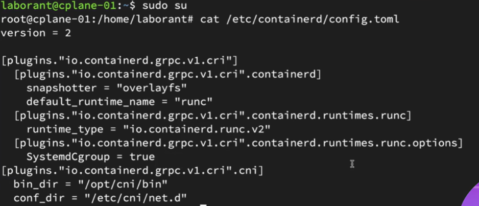

Yes. This screenshot shows the **current/default container runtime configuration in `containerd`**. Let's connect it directly to what we discussed about **RuntimeClass, shim, and Spin**.

## 1. The most important line

```toml
default_runtime_name = "runc"
```

This means:

> **If a Pod doesn't specify a `RuntimeClass`, containerd uses the `runc` runtime handler by default.**

So currently the default path is:

```text
Pod
 ↓
Kubernetes
 ↓
containerd
 ↓
runc handler
 ↓
runc
 ↓
Linux container
```

---

## 2. This section defines the `runc` handler

You have:

```toml
[plugins."io.containerd.grpc.v1.cri".containerd.runtimes.runc]
    runtime_type = "io.containerd.runc.v2"
```

There are two important things here.

### `runc`

This part:

```text
containerd.runtimes.runc
```

defines a **runtime handler named `runc`**.

Think of it as:

```text
handler name = runc
```

This is the name Kubernetes can ultimately refer to through a `RuntimeClass`.

---

### `runtime_type`

```toml
runtime_type = "io.containerd.runc.v2"
```

This tells containerd:

> When the `runc` handler is selected, use the `io.containerd.runc.v2` runtime implementation.

So:

```text
handler: runc
      ↓
io.containerd.runc.v2
      ↓
runc
```

---

# 3. What is `runc` here?

You need to distinguish **handler name** from **actual runtime**.

In this configuration:

```text
runc
```

is the **handler name**.

And:

```text
io.containerd.runc.v2
```

is the containerd runtime type/plugin that implements that handler.

So don't think:

```text
runc = RuntimeClass
```

or:

```text
runc = handler only
```

Rather:

```text
containerd
   │
   └── handler: runc
            │
            └── runtime_type: io.containerd.runc.v2
                         │
                         └── runc runtime
```

---

# 4. What is the `options` section?

You also have:

```toml
[plugins."io.containerd.grpc.v1.cri".containerd.runtimes.runc.options]
    SystemdCgroup = true
```

This configures an option for the `runc` runtime.

Specifically:

```toml
SystemdCgroup = true
```

means the runtime is configured to use **systemd for cgroup management**.

For your RuntimeClass discussion, however, the important part is not this option.

The important part is:

```text
runc handler exists
```

and:

```text
default_runtime_name = "runc"
```

---

# 5. Now imagine we install Spin

Currently your configuration is basically:

```text
containerd
   │
   └── runc
```

with:

```toml
default_runtime_name = "runc"
```

After adding Spin, you would have another runtime handler, conceptually:

```text
containerd
   ├── runc
   │    └── io.containerd.runc.v2
   │
   └── spin
        └── Spin shim/runtime
```

So you **do not remove `runc`**.

You add another runtime path.

---

# 6. This is where RuntimeClass comes in

Suppose we create:

```yaml
apiVersion: node.k8s.io/v1
kind: RuntimeClass
metadata:
  name: spin-v2
handler: spin
```

Notice:

```yaml
handler: spin
```

The word `spin` needs to correspond to a runtime handler configured in containerd.

So the relationship becomes:

```text
RuntimeClass
name: spin-v2
        │
        │ handler: spin
        ▼
containerd
runtime handler: spin
        │
        ▼
Spin shim
        │
        ▼
WebAssembly runtime
```

---

# 7. Compare your current screenshot with Spin

### Your current configuration

```toml
default_runtime_name = "runc"

[...runtimes.runc]
runtime_type = "io.containerd.runc.v2"
```

Therefore:

```text
                     containerd
                         │
                    default: runc
                         │
                         ▼
                 runc runtime
                         │
                         ▼
                  Linux container
```

### After adding Spin

Conceptually:

```text
                     containerd
                    /          \
                   /            \
                runc            spin
                 │                │
                 ▼                ▼
       io.containerd.runc.v2   Spin shim
                 │                │
                 ▼                ▼
          Linux container     Wasm runtime
```

And RuntimeClass determines which branch a particular Pod uses.

---

# 8. Very important: `default_runtime_name`

This line:

```toml
default_runtime_name = "runc"
```

does **not** mean every Pod must use `runc`.

It means:

> **`runc` is the default when no alternative runtime is selected.**

For example:

### Pod without RuntimeClass

```yaml
spec:
  containers:
  - name: app
    image: nginx
```

Flow:

```text
Pod
 ↓
No runtimeClassName
 ↓
containerd default
 ↓
runc
```

---

### Pod with Spin RuntimeClass

```yaml
spec:
  runtimeClassName: spin-v2
```

Flow:

```text
Pod
 ↓
runtimeClassName: spin-v2
 ↓
RuntimeClass/spin-v2
 ↓
handler: spin
 ↓
containerd's spin handler
 ↓
Spin shim
 ↓
Wasm runtime
```

---

# 9. One thing to correct from our previous discussion

You said:

> "so we need to change the shim and low level runtime"

A better way to say it is:

**You don't change the existing `runc` shim/runtime. You configure an additional runtime handler with its own shim/runtime.**

So instead of:

```text
❌ runc → change to Spin
```

think:

```text
✅ runc
   +
   Spin
```

Then Kubernetes can choose between them.

```text
                    containerd
                   /          \
                  /            \
              handler        handler
                runc           spin
                 │               │
                 ▼               ▼
               runc          Spin shim
                                 │
                                 ▼
                           Wasm runtime
```

---

## 10. What each line in your screenshot means

| Configuration                            | Meaning                                         |
| ---------------------------------------- | ----------------------------------------------- |
| `version = 2`                            | containerd configuration format version         |
| `plugins."io.containerd.grpc.v1.cri"`    | containerd CRI plugin configuration             |
| `containerd`                             | containerd runtime-related configuration        |
| `snapshotter = "overlayfs"`              | Uses overlay filesystem snapshots               |
| `default_runtime_name = "runc"`          | `runc` is the default runtime handler           |
| `runtimes.runc`                          | Defines the runtime handler named `runc`        |
| `runtime_type = "io.containerd.runc.v2"` | Specifies the containerd runtime implementation |
| `SystemdCgroup = true`                   | Configures systemd-based cgroup management      |
| `bin_dir = "/opt/cni/bin"`               | Location of CNI plugin binaries                 |
| `conf_dir = "/etc/cni/net.d"`            | Location of CNI configuration files             |

The **key lines for RuntimeClass** are:

```toml
default_runtime_name = "runc"

[plugins."io.containerd.grpc.v1.cri".containerd.runtimes.runc]
    runtime_type = "io.containerd.runc.v2"
```

And after adding Spin, you'd conceptually get something like:

```toml
[plugins."io.containerd.grpc.v1.cri".containerd.runtimes.spin]
    ...
```

The exact Spin configuration depends on the Spin/shim installation method.

### The mental model to remember

```text
                    Kubernetes
                        │
                        ▼
                       Pod
                  ┌─────┴─────┐
                  │           │
             no RuntimeClass  │ runtimeClassName
                  │           │
                  ▼           ▼
              default      RuntimeClass
               runc             │
                                │ handler: spin
                                ▼
                           spin handler
                                │
                                ▼
                           Spin shim
                                │
                                ▼
                         Wasm runtime
```

So **the screenshot is showing you the `runc` branch**. When the video installs Spin, it is essentially adding a **second branch** to this containerd configuration rather than replacing the first one.
