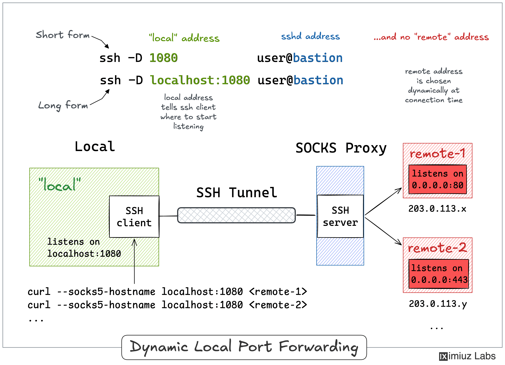

# Access a Private Kubernetes API Through an SSH SOCKS Proxy

The production Kubernetes cluster lives inside a private VPC, and its API server has no public endpoint. Turn an SSH connection to the bastion host into a SOCKS proxy and teach kubectl to use it, so the cluster becomes manageable from your workstation.

Your production Kubernetes API server is private:

- API server: `172.16.0.2:6443`
- Reachable only from inside the VPC
- Bastion host: `203.0.113.20`
- Workstation has admin credentials in `~/.kube/config`
- Workstation has no direct route to the VPC

Use SSH dynamic port forwarding to create a SOCKS proxy through the bastion, then configure `kubectl` to use that proxy persistently.

---

## Why SOCKS instead of `ssh -L`

A regular local tunnel (ssh -L local_port:host:port bastion) pins the forwarding to a single destination. Dynamic local forwarding does not specify a destination: with ssh -D and only a single local port, OpenSSH turns your ssh client into a SOCKS proxy. Each connection made through that proxy is sent over your SSH link and connected to whatever address the SOCKS client asks for - resolved and reached from the bastion's side of the network.


A normal local forward like:

```bash
ssh -L 6443:172.16.0.2:6443 bastion
```

would force you to change the kubeconfig server to `https://localhost:6443`, which can break TLS certificate validation.

Instead, use SSH dynamic forwarding:

```bash
ssh -D 1080 bastion
```

This makes `localhost:1080` a SOCKS proxy. Connections through it are sent over SSH and resolved/reached from the bastion inside the VPC. `kubectl` keeps using the real API server address `https://172.16.0.2:6443`, so certificates continue to work.



---

## Step 1 — Start the SSH SOCKS proxy

From your workstation:

```bash
ssh -N -D 1080 bastion
```

Or, if you connect by IP/user:

```bash
ssh -N -D 1080 user@203.0.113.20
```

Useful options:

- `-N` — do not run a remote command
- `-D 1080` — create a SOCKS proxy on `localhost:1080`
- `-f` — background SSH after authentication
- `-o ExitOnForwardFailure=yes` — fail if forwarding cannot be established

Example backgrounded session:

```bash
ssh -fN -D 1080 -o ExitOnForwardFailure=yes bastion
```

Check that it is running:

```bash
pgrep -af 'ssh.*-D 1080'
```

---

## Step 2 — Verify the proxy

Use `curl` through the SOCKS proxy:

```bash
curl -ik --socks5-hostname 127.0.0.1:1080 https://172.16.0.2:6443/version
```

curl speaks SOCKS, too. Before touching the kubeconfig, you can point curl at the proxy (see the --socks5-hostname option) and request https://172.16.0.2:6443/version. An HTTP 401 Unauthorized response is a good sign here - it means you reached the API server and it is asking for credentials.

You should get an HTTP response from the API server. A `401 Unauthorized` is fine — it means you reached the API server and it is asking for credentials. What matters is that it no longer times out.

You can also test `kubectl` temporarily with an environment variable:

```bash
HTTPS_PROXY=socks5://127.0.0.1:1080 kubectl get nodes
```

This works, but it only affects that shell and applies to every cluster used from that shell.

---

## Step 3 — Configure `kubectl` persistently

kubectl honors the usual HTTPS_PROXY and https_proxy environment variables, and it also understands SOCKS URLs in it (socks5://...). That is a quick way to test the tunnel, but it only affects the shell where the variable is exported, and it applies to every cluster you talk to from that shell.

The persistent, per-cluster way is the proxy-url field of a cluster entry in the kubeconfig file. You can add it by editing ~/.kube/config directly or with kubectl config set-cluster (see its --help output). Both approaches are described in the official task.

Find the cluster name in your current context:

```bash
kubectl config get-contexts
```

Or extract it directly:

```bash
CLUSTER=$(kubectl config view --minify -o jsonpath='{.contexts[0].context.cluster}')
echo "$CLUSTER"
```

Then set the proxy URL on that cluster:

```bash
kubectl config set-cluster "$CLUSTER" --proxy-url=socks5://127.0.0.1:1080
```

Verify:

```bash
kubectl config view --minify -o jsonpath='{.clusters[0].cluster.proxy-url}{"\n"}'
```

Expected output:

```text
socks5://127.0.0.1:1080
```

---

## Equivalent kubeconfig YAML

You can also edit `~/.kube/config` directly. Under the correct cluster entry, add `proxy-url`:

```yaml
clusters:
- cluster:
    certificate-authority-data: LS0t...
    server: https://172.16.0.2:6443
    proxy-url: socks5://127.0.0.1:1080
  name: prod
```

Keep the `server` pointing at the real API server address.

---

## Step 4 — Test from a new terminal

Make sure the SSH SOCKS session is still running, then from any new terminal:

```bash
kubectl get nodes
```

No extra environment variables should be needed.

---

## Cleanup

If you started SSH in the background:

```bash
pkill -f 'ssh.*-D 1080'
```

To remove the proxy setting from kubeconfig:

```bash
kubectl config set-cluster "$CLUSTER" --proxy-url=
```

---

## Key points

- Use `ssh -D 1080` to create a SOCKS proxy through the bastion.
- Do not change the kubeconfig `server` to `localhost`; keep `https://172.16.0.2:6443`.
- Use `proxy-url: socks5://127.0.0.1:1080` for persistent per-cluster proxy configuration.
- `HTTPS_PROXY=socks5://127.0.0.1:1080` is only for temporary testing.
- The SSH SOCKS session must be alive for `kubectl` to work.