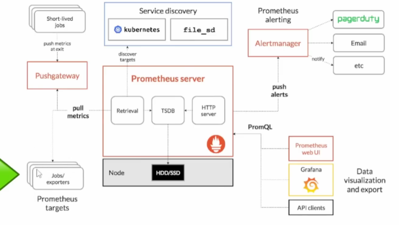

# Prometheus — Detailed Notes

These notes are organized from the uploaded transcript, keeping the concepts and terminology covered there. 

---

# 1. What is Prometheus?

**Prometheus is an open-source monitoring and alerting system** used to collect, store, query, and analyze **metrics** from applications, infrastructure, virtual machines, Kubernetes, and other systems. 

The main idea is:

```text
Applications / Infrastructure
            ↓
       Metrics
            ↓
       Prometheus
            ↓
     Store + Query
            ↓
         Grafana
            ↓
    Visualization
```

Prometheus is especially popular because it has:

* A powerful **multi-dimensional data model**
* A flexible query language called **PromQL**
* A built-in **time-series database**
* HTTP-based metric collection
* Strong Kubernetes integration
* Alerting through **Alertmanager**
* Many exporters and client libraries
* Integration with Grafana for visualization

---

# 2. What are Metrics?

A **metric is a measurement that changes over time**.

For example, for a web application:

```text
HTTP requests per second
Request latency
Number of requests
```

For a database:

```text
Active connections
Number of queries
Query latency
```

For a server:

```text
CPU usage
Memory usage
Disk I/O
Network traffic
```

Prometheus stores these measurements as **time-series data**, meaning we can see how a value changes over time. 

Example:

```text
Time        CPU Usage
10:00       30%
10:01       35%
10:02       70%
10:03       90%
10:04       45%
```

This lets you identify things such as:

* CPU spikes
* Application latency
* Increasing traffic
* Resource exhaustion
* Performance bottlenecks

---

# 3. Prometheus Time-Series Database

Prometheus is a **time-series database (TSDB)**.

Instead of simply storing:

```text
CPU = 80%
```

it stores the value together with its timestamp and identifying labels.

Conceptually:

```text
metric + labels + timestamp + value
```

For example:

```text
http_requests_total{
    method="GET",
    service="frontend",
    status="200"
}
```

This allows you to query metrics over time. 

---

# 4. Prometheus Data Model

A Prometheus metric consists mainly of:

```text
Metric Name
     +
Labels
     +
Value
     +
Timestamp
```

Example:

```text
http_requests_total{
    method="POST",
    handler="/api/users"
} 1500
```

Here:

```text
Metric:
http_requests_total

Labels:
method="POST"
handler="/api/users"

Value:
1500
```

Labels are what make Prometheus **multi-dimensional**.

For example, you can have:

```text
http_requests_total{method="GET"}
http_requests_total{method="POST"}
http_requests_total{method="DELETE"}
```

The same metric name can therefore represent different dimensions. 

---

# 5. Prometheus Pull Model

One of the most important concepts:

> **Prometheus primarily uses a pull-based monitoring model.**

Prometheus periodically **scrapes** metrics from HTTP endpoints.

```text
                Prometheus
                    │
                 HTTP GET
                    │
        ┌───────────┼───────────┐
        ↓           ↓           ↓
      App          VM       Kubernetes
     /metrics    exporter     metrics
```

The application or exporter exposes a metrics endpoint, commonly:

```text
/metrics
```

Prometheus then periodically requests that endpoint and stores the returned metrics. 

---

# 6. What is Scraping?

**Scraping** means Prometheus periodically retrieves metrics from a target.

For example:

```text
http://myapp:8080/metrics
```

Prometheus might scrape it every:

```text
30 seconds
```

Conceptually:

```text
10:00:00 → scrape
10:00:30 → scrape
10:01:00 → scrape
10:01:30 → scrape
```

Each scrape produces metric samples that Prometheus stores.

---

# 7. `/metrics` Endpoint

Applications can expose their metrics through an HTTP endpoint:

```text
/metrics
```

For example:

```text
http://myapp:8080/metrics
```

The endpoint might return:

```text
http_requests_total 1500
memory_usage_bytes 524288000
```

Prometheus can then scrape those values. 

---

# 8. Prometheus Architecture

The major components are:

```text
                    ┌──────────────────────┐
                    │      Prometheus      │
                    │                      │
Targets ───────────►│ Retrieval / Scraper  │
                    │          │           │
                    │          ▼           │
                    │     TSDB Storage     │
                    │          │           │
                    │          ▼           │
                    │     PromQL / HTTP    │
                    └──────────┬───────────┘
                               │
                    ┌──────────┴───────────┐
                    ▼                      ▼
                 Grafana              Alertmanager
                    │                      │
                    ▼                      ▼
               Dashboards          Email / Slack /
                                    PagerDuty etc.
```



The transcript identifies the major Prometheus components as the server, client libraries, Pushgateway, exporters, and Alertmanager. 

---

# 9. Prometheus Server

The **Prometheus server** is the central component.

It performs several important jobs:

### 1. Scraping

It retrieves metrics from targets.

### 2. Storage

It stores the collected metrics in its time-series database(can write data to disk).

### 3. Querying

It provides PromQL for querying metrics.

### 4. HTTP API

Other tools such as Grafana can communicate with Prometheus through HTTP.

### 5. Web UI

Prometheus has its own web interface for querying and troubleshooting metrics. 

---

# 10. Prometheus Client Libraries

Prometheus provides client libraries for multiple programming languages.

The transcript mentions examples such as:

* Go
* Python
* Java
* JavaScript / Node.js
* C#
* Ruby
* .NET
* Rust

These libraries allow developers to instrument applications and expose application metrics. 

For example, an application can create:

```text
http_requests_total
```

or:

```text
request_duration
```

and expose those metrics for Prometheus.

---

# 11. Exporters

What happens if an application doesn't natively expose Prometheus metrics?

Use an **exporter**.

An exporter converts existing application/system information into a format Prometheus can scrape.

For example:

```text
Linux Server
     │
     ▼
Node Exporter
     │
     ▼
/metrics
     │
     ▼
Prometheus
```

The transcript specifically discusses exporters for software that does not support Prometheus metrics by default. 

---

# 12. Node Exporter

For Linux servers and VMs, **Node Exporter** can expose system-level metrics.

Conceptually:

```text
Linux Server
   │
   ├── CPU
   ├── Memory
   ├── Disk
   ├── Network
   │
   ▼
Node Exporter
   │
   ▼
/metrics
   │
   ▼
Prometheus
```

This allows Prometheus to monitor infrastructure such as:

* Physical servers
* Virtual machines
* EC2 instances

The transcript specifically describes Node Exporter exposing a `/metrics` endpoint for these systems. 

---

# 13. Pushgateway

Prometheus normally uses a **pull model**.

But some workloads are short-lived and cannot easily be scraped.

Examples:

```text
Cron job
Batch job
One-time task
Short-lived process
```

For these cases, Prometheus provides **Pushgateway**.

Architecture:

```text
Short-lived Job
      │
      │ push metrics
      ▼
Pushgateway
      │
      │ Prometheus scrapes
      ▼
Prometheus
```

The important point is:

> **The job pushes metrics to Pushgateway, but Prometheus still pulls metrics from Pushgateway.**


---

# 14. When to Use Pushgateway

Pushgateway can be useful when:

```text
Job starts
   ↓
does some work
   ↓
finishes
   ↓
can't be scraped anymore
```

The job can push its final metrics to Pushgateway.

However, Pushgateway should not be treated as a general replacement for Prometheus's pull model.

---

# 15. Alertmanager

Prometheus can generate alerts based on metric conditions.

**Alertmanager** handles those alerts and sends them to notification systems.

Architecture:

```text
Prometheus
    │
    │ Alert
    ▼
Alertmanager
    │
    ├── Email
    ├── Slack
    ├── Microsoft Teams
    └── PagerDuty
```

The transcript specifically mentions Alertmanager for sending alerts to Slack, Microsoft Teams, email, and PagerDuty. 

---

# 16. Prometheus Metric Types

The transcript covers three major metric types:

1. **Counter**
2. **Gauge**
3. **Histogram**

---

# 17. Counter

A **Counter** is a value that monotonically increases.

For example:

```text
Total HTTP requests
Total errors
Total processed jobs
Total network packets
```

Example:

```text
10
20
30
40
50
```

It normally doesn't decrease.

A counter can reset when the application restarts, but conceptually its purpose is to count events.

Example:

```text
http_requests_total
```

The transcript describes counters as useful for counting requests received by a microservice. 

---

# 18. Gauge

A **Gauge** represents a value that can go **up or down**.

Examples:

```text
CPU usage
Memory usage
Temperature
Active connections
Concurrent requests
```

Example:

```text
30
40
70
55
20
80
```

Unlike a counter, a gauge can increase and decrease. 

### Easy way to remember

```text
Counter → keeps increasing

Gauge → can go up and down
```

---

# 19. Histogram

A **Histogram** samples observations and places them into configurable buckets.

It is commonly useful for things such as:

```text
Request latency
Response time
Function execution time
```

For example:

```text
Request latency

0–100 ms
100–200 ms
200–500 ms
500–1000 ms
>1000 ms
```

Prometheus records counts for these buckets along with the total sum and count of observations. 

Histograms can be used to calculate things such as:

* Average latency
* Latency distributions
* Percentiles

---

# 20. Counter vs Gauge vs Histogram

| Type      | Behavior                     | Example         |
| --------- | ---------------------------- | --------------- |
| Counter   | Increasing value             | Total requests  |
| Gauge     | Goes up/down                 | CPU usage       |
| Histogram | Distribution of observations | Request latency |

### Interview shortcut

> **Counter counts events, Gauge measures current state, Histogram measures distributions.**

---

# 21. PromQL

Prometheus uses **PromQL — Prometheus Query Language**.

It allows you to query and analyze time-series data.

For example:

```text
http_requests_total
```

can be queried to inspect request metrics.

PromQL is one of Prometheus's major features because its data model allows powerful queries over labeled time-series data. 

---

# 22. Scrape Configuration

Prometheus needs to know:

> **What targets should I scrape?**

This is defined through the **scrape configuration**.

A simplified example:

```yaml
scrape_configs:
  - job_name: "myapp"
    static_configs:
      - targets:
          - "myapp:8080"
```

Conceptually:

```text
scrape_configs
      │
      └── job
           │
           └── targets
                 │
                 ├── app1
                 ├── app2
                 └── app3
```

The transcript describes creating jobs and defining targets under `static_configs`. 

---

# 23. Job

A Prometheus **job** is a logical group of scrape targets.

For example:

```yaml
scrape_configs:
  - job_name: "frontend"
    ...

  - job_name: "backend"
    ...

  - job_name: "database"
    ...
```

You can organize your monitoring targets by application/service.

The transcript recommends generally creating a job per application/service. 

---

# 24. Static Configuration

Targets can be explicitly specified:

```yaml
static_configs:
  - targets:
      - "10.0.0.10:8080"
      - "10.0.0.11:8080"
```

This is useful when the target addresses are known and relatively static.

However, in Kubernetes environments, manually maintaining targets becomes difficult because workloads are dynamic.

---

# 25. Service Discovery

Kubernetes workloads can:

```text
Start
Stop
Move
Scale
Change IP
```

Therefore, manually maintaining Prometheus targets isn't ideal.

Prometheus supports **service discovery**, including Kubernetes service discovery. 

Instead of manually adding every pod:

```text
Pod A → 10.0.0.1
Pod B → 10.0.0.2
Pod C → 10.0.0.3
```

service discovery can dynamically discover targets.

---

# 26. ServiceMonitor

In Kubernetes environments, the transcript discusses **ServiceMonitor**.

A ServiceMonitor is a Kubernetes resource that tells the Prometheus operator/controller how to monitor a Kubernetes Service.

Conceptually:

```text
ServiceMonitor
      │
      ▼
Kubernetes Service
      │
      ▼
Application / Pods
      │
      ▼
/metrics
      │
      ▼
Prometheus
```

This avoids manually editing Prometheus's configuration every time a service is created. 

### Important interview point

> **ServiceMonitor is not a core Prometheus primitive by itself; it is associated with the Prometheus Operator ecosystem.**

---

# 27. Scrape Interval

The **scrape interval** determines how frequently Prometheus retrieves metrics.

For example:

```yaml
global:
  scrape_interval: 30s
```

means:

```text
Every 30 seconds
       ↓
Prometheus scrapes targets
```

The transcript notes that Kubernetes environments commonly use a 30-second scrape interval in the discussed setup. 

---

# 28. Scrape Interval Tradeoff

More frequent scraping:

```text
10 seconds
```

means:

* More data
* More accurate observation of rapidly changing metrics
* More network/storage overhead

Less frequent scraping:

```text
5 minutes
```

means:

* Less data
* Lower overhead
* Higher chance of missing short-lived spikes

So there is a tradeoff:

```text
Short interval
    ↓
More detailed data
    ↓
More resource usage
```

The transcript specifically discusses this tradeoff for CPU spikes and request-rate metrics. 

---

# 29. Evaluation Interval

The **evaluation interval** determines how frequently Prometheus evaluates rules.

Rules can be used to:

* Create new time series
* Generate alerts

Conceptually:

```text
Metrics
   ↓
PromQL / Rules
   ↓
Evaluation
   ↓
Alert / Recording rule
```

The transcript distinguishes the evaluation interval from the scrape interval. 

---

# 30. TLS Configuration

Prometheus can scrape targets over HTTPS.

For example:

```text
https://my-service:8443/metrics
```

The scrape configuration can contain TLS-related configuration such as:

* CA certificate
* Client certificate
* Key

This is useful when the metrics endpoint requires HTTPS/TLS. 

---

# 31. Authentication

Metrics endpoints can also require authentication.

The transcript mentions HTTP authentication such as **basic authentication**.

Conceptually:

```text
Prometheus
    │
    │ HTTPS + credentials
    ▼
Protected /metrics endpoint
```

This is particularly relevant for systems such as internal Kubernetes resources where metrics endpoints may be protected. 

---

# 32. Remote Write

Prometheus also supports **remote write**.

Instead of keeping all metrics only in the local Prometheus instance, Prometheus can send metrics to external systems.

Conceptually:

```text
Prometheus
     │
     │ remote_write
     ▼
External Storage / Monitoring System
```

The transcript gives examples such as:

* Third-party monitoring systems
* Another database
* Another Prometheus instance

This can be used to support longer-term storage or distributed/high-availability architectures. 

---

# 33. Prometheus and Grafana

Prometheus is excellent for:

```text
Collecting
Storing
Querying
```

Grafana is commonly used for:

```text
Visualization
Dashboards
```

Architecture:

```text
Applications
     ↓
Prometheus
     ↓
PromQL
     ↓
Grafana
     ↓
Dashboards
```

The transcript uses Grafana as the visualization layer on top of Prometheus. 

---

# 34. Why Grafana?

Prometheus has its own UI, which is useful for:

* Testing queries
* Troubleshooting
* Checking metrics
* Checking target health

But Grafana provides richer dashboards and visualization.

For example:

```text
                    Grafana
                       │
          ┌────────────┼────────────┐
          ▼            ▼            ▼
        CPU          Memory       Requests
       Panel          Panel         Panel
```

---

# 35. Prometheus UI

Prometheus itself provides a web UI where you can:

* Enter PromQL queries
* Search for metrics
* Inspect metric values
* Check targets
* Troubleshoot scraping

The transcript demonstrates using the Prometheus query page and target-health page for troubleshooting. 

---

# 36. Target Health

A very useful troubleshooting location is:

```text
Status → Targets
```

You can determine whether Prometheus can successfully scrape a target.

For example:

```text
Target                    State
--------------------------------
app-1:8080                UP
app-2:8080                UP
app-3:8080                DOWN
```

If a target is down, Prometheus may show errors such as:

```text
connection refused
```

The transcript specifically recommends checking target health and Prometheus logs when metrics aren't appearing. 

---

# 37. Prometheus Troubleshooting Flow

If metrics are missing:

```text
Metric missing
     │
     ▼
Check Prometheus Targets
     │
     ├── DOWN
     │     ↓
     │   Check endpoint/network
     │
     └── UP
           ↓
       Check metric
           ↓
       Check PromQL
```

Also check:

```bash
kubectl logs
```

or Prometheus logs depending on your deployment.

The transcript specifically recommends checking Prometheus logs and target health when there are scraping/configuration problems. 

---

# 38. Kubernetes Monitoring

Prometheus integrates well with Kubernetes.

It can monitor:

```text
Kubernetes API server
kubelet
nodes
pods
containers
services
applications
```

The transcript explicitly discusses Kubernetes metrics and Kubernetes service discovery. 

Typical Kubernetes monitoring architecture:

```text
                    Prometheus
                        │
        ┌───────────────┼────────────────┐
        ▼               ▼                ▼
     Nodes             Pods           Services
        │               │                │
 Node Exporter       /metrics         /metrics
        │               │                │
        └───────────────┴────────────────┘
                        │
                        ▼
                   Prometheus
                        │
                        ▼
                     Grafana
```

---

# 39. Application Monitoring

Applications can expose custom business/application metrics.

For example:

```text
http_requests_total
orders_created_total
payment_failures_total
active_users
request_duration
```

This is where Prometheus client libraries become useful.

Developers instrument the application, and Prometheus scrapes the resulting `/metrics` endpoint. 

---

# 40. Infrastructure Monitoring

For infrastructure, Prometheus can monitor:

```text
CPU
Memory
Disk
Network
System performance
```

Node Exporter can expose these metrics for servers/VMs. 

Example architecture:

```text
EC2
 │
 ▼
Node Exporter
 │
 ▼
/metrics
 │
 ▼
Prometheus
 │
 ▼
Grafana
```

---

# 41. Prometheus Installation

The transcript describes several ways to run Prometheus.

One approach is downloading the Prometheus binary and running it with a configuration file.

Another simple approach for labs is using Docker.

For example:

```text
Docker
  │
  └── Prometheus container
          │
          └── prometheus.yml
```

The transcript demonstrates running Prometheus using Docker Compose. 

---

# 42. Prometheus Configuration File

The Prometheus configuration file is commonly:

```text
prometheus.yml
```

It can contain:

```yaml
global:
  scrape_interval: 30s

scrape_configs:
  - job_name: "myapp"
    static_configs:
      - targets:
          - "myapp:8080"
```

The important sections discussed in the transcript include:

```text
global
scrape_configs
job_name
static_configs
targets
TLS configuration
HTTP configuration
service discovery
```


---

# 43. Complete Monitoring Flow

The most important architecture to remember:

```text
                    ┌─────────────────┐
                    │   Applications  │
                    └────────┬────────┘
                             │
                         /metrics
                             │
                             ▼
                    ┌─────────────────┐
                    │   Prometheus    │
                    │                 │
                    │    Scraper      │
                    │       ↓         │
                    │      TSDB       │
                    │       ↓         │
                    │     PromQL      │
                    └───────┬─────────┘
                            │
              ┌─────────────┴──────────────┐
              ▼                            ▼
         ┌──────────┐                 ┌─────────────┐
         │ Grafana  │                 │ Alertmanager│
         └────┬─────┘                 └──────┬──────┘
              │                              │
              ▼                              ▼
         Dashboards                  Email / Slack /
                                     PagerDuty etc.
```

---

# 44. Prometheus vs Grafana

A very common interview question.

| Prometheus               | Grafana                                |
| ------------------------ | -------------------------------------- |
| Collects metrics         | Visualizes metrics                     |
| Stores time-series data  | Creates dashboards                     |
| Uses PromQL              | Uses Prometheus as a data source       |
| Scrapes targets          | Queries data sources                   |
| Generates alerting rules | Can visualize/alert depending on setup |

### Easy answer

> **Prometheus is primarily the metrics collection, storage, and querying system. Grafana is primarily the visualization and dashboarding layer.**

---

# 45. Prometheus vs Pushgateway

### Prometheus

```text
Prometheus → Target
```

Pull model.

### Pushgateway

```text
Job → Pushgateway
Prometheus → Pushgateway
```

Used primarily for short-lived jobs that cannot be directly scraped.

---

# 46. Counter vs Gauge — Interview Question

**Question:** When would you use a counter?

> When I need to count something that monotonically increases, such as total HTTP requests, total errors, or total jobs processed.

**Question:** When would you use a gauge?

> When I need to represent a current value that can increase or decrease, such as CPU utilization, memory usage, active connections, or queue length.

---

# 47. Histogram — Interview Answer

> **A histogram is used when I want to understand the distribution of observed values, such as request latency. Prometheus stores observations in configurable buckets and also maintains the count and sum, allowing us to calculate latency distributions and percentiles.**

---

# 48. Important Interview Questions

### Q1. What is Prometheus?

> Prometheus is an open-source monitoring and alerting system that collects, stores, and queries time-series metrics.

### Q2. Is Prometheus pull or push based?

> Prometheus primarily uses a **pull-based model**, where it periodically scrapes metrics from HTTP endpoints.

### Q3. What is `/metrics`?

> It is an HTTP endpoint exposed by an application or exporter containing metrics that Prometheus can scrape.

### Q4. What is PromQL?

> PromQL is Prometheus's query language used to query and analyze time-series metrics.

### Q5. What is an exporter?

> An exporter exposes metrics for systems or applications that don't natively expose Prometheus-compatible metrics.

### Q6. What is Node Exporter?

> Node Exporter exposes system-level metrics from Linux machines, such as CPU, memory, disk, and network metrics.

### Q7. What is Pushgateway?

> Pushgateway provides an intermediary endpoint where short-lived jobs can push metrics, which Prometheus can then scrape.

### Q8. What is Alertmanager?

> Alertmanager receives alerts from Prometheus and handles notification routing to systems such as email, Slack, and PagerDuty.

### Q9. Counter vs Gauge?

> Counter is for monotonically increasing values; Gauge is for values that can increase or decrease.

### Q10. What is a Histogram?

> A histogram measures the distribution of observations, commonly request latency, using configurable buckets.

### Q11. How does Prometheus discover Kubernetes targets?

> It can use Kubernetes service discovery, and in the Prometheus Operator ecosystem, resources such as ServiceMonitor can be used to configure scraping.

### Q12. How do you troubleshoot a target that isn't being scraped?

> I first check the Prometheus Targets page to see whether the target is `UP` or `DOWN`, inspect the error message, verify network connectivity and the `/metrics` endpoint, and then check Prometheus logs and configuration.

---

# 49. Most Important Concepts to Remember

For your **DevOps/Kubernetes interviews**, prioritize these:

```text
                    PROMETHEUS
                        │
       ┌────────────────┼────────────────┐
       ▼                ▼                ▼
    Scraping          TSDB             PromQL
       │                │                │
       ▼                ▼                ▼
   /metrics          Time-series       Queries
       │
       ▼
    Targets
       │
 ┌─────┼─────────┐
 ▼     ▼         ▼
Apps  Nodes   Kubernetes
 │     │         │
 │ Node          │
 │ Exporter      │
 └─────┬─────────┘
       ▼
   Prometheus
       │
   ┌───┴────┐
   ▼        ▼
Grafana  Alertmanager
   │        │
   ▼        ▼
Dashboard Notifications
```

### The five things you absolutely should know:

1. **Prometheus = metrics collection + TSDB + querying + alerting**
2. **Prometheus primarily pulls metrics through `/metrics`**
3. **PromQL = query language**
4. **Counter / Gauge / Histogram = key metric types**
5. **Grafana visualizes Prometheus data; Alertmanager handles notifications**

These are the core concepts covered by the transcript. 
