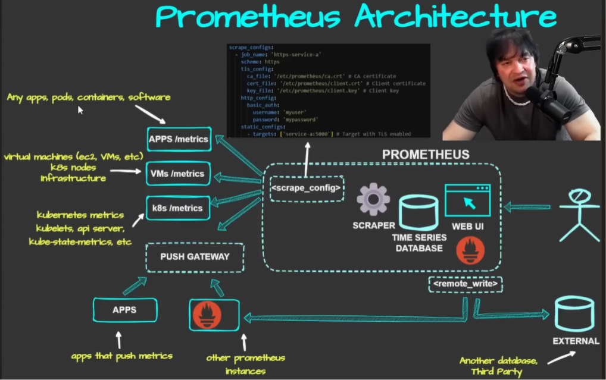

Absolutely. This diagram represents the **complete Prometheus architecture described in the transcript**. The easiest way to understand it is to follow the **flow of metrics from left → Prometheus → right**.

The transcript describes Prometheus as a system that **scrapes metrics, stores them in a time-series database, allows them to be queried, and integrates with external systems**. 

# Prometheus Architecture — Step by Step

```text
                    ┌───────────────────────────┐
                    │        PROMETHEUS         │
                    │                           │
                    │  Scraper                  │
                    │     ↓                     │
Targets ──────────► │  Time Series Database     │
                    │     ↓                     │
                    │  Web UI / HTTP API        │
                    └────────────┬──────────────┘
                                 │
                            remote_write
                                 │
                                 ▼
                         External Storage
```



There are essentially **two different directions** of data flow in this architecture:

### Pull model

```text
Applications / VMs / Kubernetes
             ↓
        Prometheus
```

### Push / remote-write paths

```text
Short-lived Apps
      ↓
Pushgateway
      ↑
Prometheus scrapes it


Prometheus
    ↓
remote_write
    ↓
External system
```

---

# 1. Applications → `/metrics`

On the left side of the diagram you have:

```text
        APPS /metrics
```

These could be:

* Your own applications
* Microservices
* Containers
* Open-source software
* Proxies
* Load balancers
* Databases

The application exposes a metrics endpoint, commonly:

```text
http://application:8080/metrics
```

Prometheus then periodically accesses that endpoint.

The transcript explains that applications can expose an HTTP `/metrics` endpoint, which Prometheus can scrape. 

### Example

Imagine your Go application exposes:

```text
http_requests_total 5000
```

Prometheus periodically requests:

```text
GET /metrics
```

and receives:

```text
http_requests_total 5000
```

Prometheus then stores that metric.

---

# 2. VMs → `/metrics`

The next box is:

```text
        VMs /metrics
```

This represents:

* EC2 instances
* Virtual machines
* Physical servers
* Other infrastructure

Normally, these systems don't expose Prometheus metrics directly in the required format.

So you can install an exporter such as **Node Exporter**.

```text
Linux VM
   │
   ▼
Node Exporter
   │
   ▼
/metrics
   │
   ▼
Prometheus
```

Node Exporter exposes system metrics such as:

```text
CPU
Memory
Disk
Network
```

The transcript specifically explains using Node Exporter on VMs/EC2/physical machines to create a `/metrics` endpoint. 

---

# 3. Kubernetes → Metrics

The diagram also has:

```text
        K8S /metrics
```

Kubernetes has many things that can expose metrics, including:

```text
kubelet
API server
kube-state-metrics
containers
pods
applications
```

Prometheus can scrape these metrics.

So conceptually:

```text
Kubernetes Cluster
       │
       ├── API Server
       ├── Kubelet
       ├── Pods
       ├── Services
       └── kube-state-metrics
                 │
                 ▼
              /metrics
                 │
                 ▼
             Prometheus
```

The transcript specifically mentions Kubernetes metrics such as the API server, kubelet and kube-state metrics. 

---

# 4. The Most Important Part — `scrape_config`

Look at the center-left of the Prometheus box:

```text
┌─────────────────────┐
│    scrape_config    │
└─────────────────────┘
```

This tells Prometheus:

> **What should I scrape and how should I scrape it?**

For example:

```yaml
scrape_configs:
  - job_name: "my-app"
    static_configs:
      - targets:
          - "my-app:8080"
```

This means:

```text
job = my-app
target = my-app:8080
```

Prometheus will scrape:

```text
http://my-app:8080/metrics
```

The transcript describes `scrape_configs` as the main configuration that tells Prometheus what targets to scrape. 

---

# 5. What is a `job`?

Inside `scrape_configs`, you normally define jobs.

Example:

```yaml
scrape_configs:

  - job_name: "frontend"
    ...

  - job_name: "backend"
    ...

  - job_name: "database"
    ...
```

A job is basically a logical group of targets.

The transcript notes that you can generally create a job per application/service. 

---

# 6. The `targets`

Under each job you specify targets.

Example:

```yaml
static_configs:
  - targets:
      - "10.0.0.10:8080"
      - "10.0.0.11:8080"
```

Prometheus will scrape those endpoints.

In a dynamic environment like Kubernetes, instead of manually maintaining IP addresses, you normally use **service discovery**.

The transcript specifically highlights Kubernetes service discovery because Kubernetes workloads can dynamically come and go. 

---

# 7. Why is there TLS configuration in the diagram?

At the top of the diagram, the `scrape_config` example contains:

```yaml
scheme: https

tls_config:
  ca_file: ...
  cert_file: ...
  key_file: ...
```

This demonstrates that Prometheus doesn't have to scrape only HTTP.

It can scrape:

```text
HTTP
HTTPS
```

For HTTPS targets, you can configure things such as:

```text
CA certificate
Client certificate
Private key
```

The transcript explains that TLS configuration is used when scraping services over HTTPS. 

---

# 8. Authentication

The diagram also shows:

```yaml
http_config:
  basic_auth:
    username: "myuser"
    password: "mypassword"
```

This means the metrics endpoint can require authentication.

So the flow becomes:

```text
Prometheus
    │
    │ HTTPS + authentication
    ▼
Protected /metrics endpoint
```

This is useful when the application or infrastructure component doesn't expose metrics publicly.

The transcript specifically demonstrates HTTP basic authentication as part of scrape configuration. 

---

# 9. Prometheus Scraper

Inside the Prometheus box you see:

```text
        SCRAPER
```

This is the component responsible for retrieving metrics.

For example:

```text
Prometheus
    │
    │ GET /metrics
    ▼
Application
```

The application responds:

```text
http_requests_total 5000
cpu_usage 72
```

The scraper receives those metrics and passes them into Prometheus's storage.

---

# 10. Time-Series Database

Next is:

```text
TIME SERIES
DATABASE
```

This is where Prometheus stores the scraped metrics.

For example:

```text
http_requests_total{
    method="GET",
    service="frontend"
}
```

might produce values over time:

```text
10:00 → 1000
10:01 → 1100
10:02 → 1250
10:03 → 1400
```

This is why Prometheus is called a **time-series database**.

The transcript emphasizes that Prometheus both **scrapes and stores metrics** in its built-in time-series database. 

---

# 11. Why doesn't Prometheus need MySQL/PostgreSQL?

A useful interview point from the transcript:

> Prometheus has its own time-series database.

Therefore, you don't need to deploy a separate SQL database just to store Prometheus metrics.

```text
Prometheus
    │
    └── Built-in TSDB
```

The transcript specifically notes that Prometheus doesn't rely on an external SQL cluster for its normal time-series storage. 

---

# 12. Prometheus Web UI

On the right side inside Prometheus:

```text
       WEB UI
```

Prometheus provides its own web interface.

You can use it to:

* Search metrics
* Run PromQL queries
* Check metric values
* Check targets
* Troubleshoot scraping

For example:

```text
http_requests_total
```

You can enter that metric into the Prometheus UI and inspect its values.

The transcript demonstrates using the Prometheus query page to search for metrics. 

---

# 13. Prometheus → Grafana

The diagram doesn't explicitly show Grafana, but this is an important part of the architecture discussed in the transcript.

Grafana connects to Prometheus.

```text
Prometheus
     │
     │ PromQL / HTTP
     ▼
  Grafana
     │
     ▼
Dashboards
```

Prometheus provides the data.

Grafana provides richer visualization.

For example:

```text
┌───────────────────────────┐
│       Grafana             │
├───────────────────────────┤
│ CPU Usage       72%       │
│ Memory          61%       │
│ Requests/sec    450       │
│ Error Rate      0.5%      │
│ Latency         120ms     │
└───────────────────────────┘
```

The transcript describes Grafana as the visualization layer for Prometheus metrics. 

---

# 14. Pushgateway

Now look at the lower-left part of the diagram:

```text
        PUSH GATEWAY
```

This is different from the normal Prometheus flow.

Normally:

```text
Prometheus → Application
```

But some applications/jobs cannot easily be scraped.

For example:

```text
Cron Job
Batch Job
Short-lived Job
```

So:

```text
Application
     │
     │ PUSH metrics
     ▼
Pushgateway
     │
     │ Prometheus SCRAPES
     ▼
Prometheus
```

### Very important

Don't say:

> "Prometheus becomes push-based."

Instead say:

> **A job pushes metrics to Pushgateway, and Prometheus continues to use its pull model by scraping Pushgateway.**

The transcript explains this exact architecture for jobs that aren't available for normal scraping. 

---

# 15. Why would an Application Push Metrics?

The diagram shows:

```text
APPS
  ↓
PUSH GATEWAY
```

These are applications/jobs that need to push their metrics.

For example:

```text
Backup Job
   ↓
Backup completed
   ↓
Push "backup_success = 1"
   ↓
Pushgateway
   ↓
Prometheus
```

This can be useful for short-lived jobs that disappear before Prometheus gets a chance to scrape them.

---

# 16. Other Prometheus Instances → Pushgateway

The diagram also shows another Prometheus instance sending metrics toward Pushgateway.

The transcript explains that Pushgateway can also be used when **other Prometheus instances need to push metrics** into a central monitoring architecture. 

Conceptually:

```text
Prometheus A
     │
     ▼
Pushgateway
     ▲
     │
Prometheus B
```

This can help distribute metrics between Prometheus instances.

---

# 17. Remote Write

Now look at the bottom-right:

```text
        <remote_write>
              │
              ▼
          EXTERNAL
```

This is **different from scraping**.

With normal scraping:

```text
Target
   ↓
Prometheus
```

With remote write:

```text
Prometheus
   ↓
remote_write
   ↓
External system
```

Prometheus sends its collected time-series data somewhere else.

The transcript mentions sending data to:

* Another Prometheus instance
* Another database
* Third-party monitoring systems
* Long-term storage systems


---

# 18. Why Use Remote Write?

Imagine you have:

```text
Prometheus
```

and you want to send its metrics to an external monitoring platform.

Instead of:

```text
External platform → scrape Prometheus
```

you can have:

```text
Prometheus
    │
    │ remote_write
    ▼
External platform
```

This is useful for:

* Long-term storage
* Centralized monitoring
* Sending metrics to another system
* Multi-Prometheus architectures

---

# 19. Pushgateway vs Remote Write

This is an important interview distinction.

### Pushgateway

```text
Application
    ↓
Pushgateway
    ↓
Prometheus
```

Purpose:

> Allow short-lived jobs to expose metrics to Prometheus.

### Remote Write

```text
Prometheus
    ↓
External system
```

Purpose:

> Send metrics collected by Prometheus to external/remote storage or another monitoring system.

### Remember

```text
Pushgateway = metrics INTO Prometheus architecture

Remote Write = metrics OUT OF Prometheus
```

---

# 20. Complete Flow of This Diagram

Now put everything together.

### Normal application

```text
Application
    │
    │ /metrics
    ▼
Prometheus Scraper
    │
    ▼
Time-Series Database
```

### VM

```text
VM
 │
 ▼
Node Exporter
 │
 ▼
/metrics
 │
 ▼
Prometheus
```

### Kubernetes

```text
Kubernetes
 │
 ├── kubelet
 ├── API server
 ├── kube-state-metrics
 └── applications
          │
          ▼
       /metrics
          │
          ▼
      Prometheus
```

### Short-lived job

```text
Job
 │
 │ push
 ▼
Pushgateway
 │
 │ scrape
 ▼
Prometheus
```

### External storage

```text
Prometheus
    │
    │ remote_write
    ▼
External Database /
Monitoring System
```

### Visualization

```text
Prometheus
    │
    │ query
    ▼
Grafana
    │
    ▼
Dashboards
```

---

# 21. The Most Important Interview Explanation

If the interviewer shows you this diagram and asks:

> **"Explain Prometheus architecture."**

You can answer:

> **Prometheus follows primarily a pull-based monitoring architecture. Applications, VMs, Kubernetes components, and exporters expose metrics through HTTP endpoints, commonly `/metrics`. The Prometheus scraper periodically retrieves these metrics based on the `scrape_configs` configuration and stores them in its built-in time-series database. Prometheus provides PromQL and a web UI for querying and troubleshooting the collected metrics.**
>
> **For workloads that cannot be directly scraped, such as short-lived batch or cron jobs, Pushgateway can be used as an intermediary: the job pushes metrics to Pushgateway, and Prometheus scrapes Pushgateway. Prometheus can also use `remote_write` to send collected metrics to external storage or monitoring systems. Finally, tools such as Grafana can query Prometheus and provide dashboards and visualization.**

That is the **core story of the entire diagram**.

---

# 22. One-Line Memory Trick

Remember the architecture as:

```text
         COLLECT              STORE             VISUALIZE
            ↓                   ↓                   ↓

Apps ───────┐
VMs ────────┤
K8s ────────┤
            ▼
        PROMETHEUS
       ┌───────────┐
       │  Scraper  │
       │     ↓     │
       │    TSDB   │
       │     ↓     │
       │  PromQL   │
       └─────┬─────┘
             │
       ┌─────┴──────┐
       ▼            ▼
    Grafana     remote_write
                    │
                    ▼
               External
```

And separately:

```text
Short-lived Job
      ↓
Pushgateway
      ↓
Prometheus
```

**The key distinction is:**

> **Prometheus pulls metrics from targets, stores them in its TSDB, lets you query them with PromQL, Grafana visualizes them, Alertmanager handles alerts, Pushgateway handles metrics from short-lived jobs, and remote_write sends metrics outside Prometheus.**
