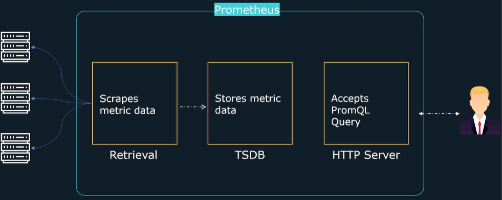
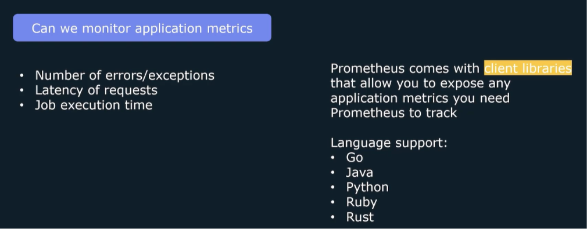
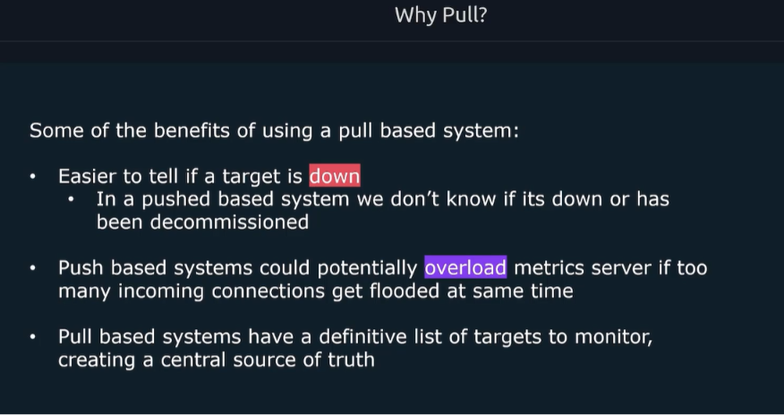

# Prometheus: A Comprehensive Overview

## Introduction

In this guide, we'll explore Prometheus, an open-source monitoring solution that has become a cornerstone of modern infrastructure observability. We'll cover its use cases, architecture, and key concepts to help you understand why it was created and how it can benefit your organization.

---

## Why We Need Prometheus - Use Cases

### 1. Multi-Data Center Monitoring

**The Challenge:**
- Organizations often have multiple data centers scattered across different geographical locations
- Services may run on various cloud providers like AWS or other cloud platforms
- Teams need visibility into all these distributed systems

**The Solution:**
- Prometheus can collect metrics from multiple data centers simultaneously
- Built-in dashboarding utilities allow you to present all data on a single, clean dashboard
- This provides a unified view of your entire infrastructure

### 2. Proactive Alerting

**The Challenge:**
- Several outages have occurred due to high memory usage on MySQL database servers
- Operations teams need to be notified before issues impact end users
- Manual monitoring is inefficient and error-prone

**The Solution:**
- Prometheus features built-in alerting capabilities
- Can track various metrics and generate alerts when they cross specific thresholds
- Alerts can be sent through multiple notification channels:
  - Email
  - Slack
  - SMS
  - Other integration methods
- This enables proactive measures before issues affect users

### 3. Application Performance Analysis

**The Challenge:**
- A new video upload feature has been added to a website
- Teams need to determine at which video length application performance starts to degrade
- Need to correlate file size with latency to identify bottlenecks

**The Solution:**
- Prometheus can scrape and collect average file size data
- Can also collect average latency per request data
- Built-in visualization tools allow plotting both metrics together
- Teams can cross-reference to find the exact point where latency becomes problematic

---

## What is Prometheus?

Prometheus is an **open-source monitoring tool** that:

- **Collects metric data** from various sources
- **Provides visualization tools** for the collected data
- **Includes built-in alerting functionality**
- Allows configuration of rules that trigger alerts when metrics cross thresholds

### How Prometheus Works

- **Scrapes targets** that expose metrics through HTTP endpoints
- Applications or systems host metrics on specific HTTP endpoints
- Prometheus sends GET requests to retrieve these metrics
- Scraped metrics are stored in a **Time Series Database (TSDB)**
- Data can be queried using **PromQL** (Prometheus Query Language)

### What Can Prometheus Monitor?

- **System metrics:**
  - CPU utilization
  - Memory utilization
  - Disk space
  - Service uptime

- **Application-specific metrics:**
  - Number of exceptions
  - Request latency
  - Total number of pending requests

- **Other sources:**
  - Networking devices
  - Databases
  - Various platforms, software, and tools

---

## What Prometheus is NOT Designed For

Prometheus is exclusively designed for monitoring **numeric time series data**. It is **not** designed for:

- Events
- System logs
- Traces

---

## Prometheus Background

- **Originally sponsored by** SoundCloud
- **Joined the Cloud Native Computing Foundation (CNCF)** in 2016
- **Primarily written in** Go (Golang)
- **Documentation available at:** prometheus.io

---

## Prometheus Architecture

### Core Prometheus Server Components

The main Prometheus server consists of three parts:

1. **Data Retrieval Worker**
   - Responsible for collecting metrics from targets
   - Sends HTTP requests to specific targets
   - Collects and processes metric data

2. **Time Series Database (TSDB)**
   - Stores all collected metrics
   - Optimized for time-series data

3. **HTTP Server**
   - Allows retrieval of stored data
   - Accepts queries using PromQL
   - Enables visualization of metrics

### Full Architecture Components

#### 1. Exporters
- **Purpose:** Mini processes that run on targets
- **Function:** Serve up metrics for Prometheus to scrape
- **Why needed:** Systems don't automatically present metrics in Prometheus format
- **How they work:** Convert internal data into Prometheus-compatible metrics
- **Examples:**
  - Node Exporter (Linux server metrics)
  - Windows Exporter
  - MySQL Exporter
  - Apache Exporter
  - HAProxy Exporter

#### 2. Push Gateway
- **Purpose:** Handle short-lived jobs that can't use the pull model
- **Use case:** Jobs that don't last long enough to be scraped
- **How it works:**
  - Short-lived jobs send data to Push Gateway
  - Prometheus scrapes data from Gateway like any other target

#### 3. Service Discovery
- **Purpose:** Dynamically provide a list of targets to scrape
- **Why needed:** Environments like Kubernetes or cloud providers have dynamic instances
- **Benefit:** Eliminates the need to hardcode target values
- **Use cases:**
  - Kubernetes environments
  - Cloud providers with EC2 instances
  - Any environment with dynamic infrastructure

#### 4. Alert Manager
- **Purpose:** Handle alert notifications
- **Function:**
  - Receives alerts from Prometheus
  - Manages notification delivery
  - Handles deduplication and grouping
- **Integration:**
  - Email
  - SMS
  - Slack
  - SMTP
  - Other notification channels

#### 5. Visualization Tools
- **Options:**
  - Prometheus Web UI
  - Grafana
- **Query Language:** PromQL
- **Purpose:** Query and visualize metrics through the HTTP server

---

## Metrics Collection Process

### Pull-Based Model

**How it works:**
- Prometheus sends HTTP requests to targets
- Targets expose metrics at `/metrics` endpoint (configurable)
- Prometheus must know all targets it should scrape

**Configuration:**
- Default endpoint: `/metrics`
- Can be customized in Prometheus configuration

### How Exporters Work

1. Exporter runs on the target system
2. Collects metrics from the specific service/application/system
3. Converts metrics into Prometheus expected format
4. Exposes a `/metrics` endpoint
5. Prometheus scrapes this endpoint

### Native Exporters

Prometheus provides several native exporters for common systems:
- Node Exporter (Linux)
- Windows Exporter
- MySQL Exporter
- Apache Exporter
- HAProxy Exporter
- And many more

### Custom Application Metrics

For custom applications, Prometheus provides **client libraries**:

**Supported languages:**
- Go
- Java
- Python
- Ruby
- Rust
- Third-party support for additional languages

**What you can track:**
- Total number of errors/exceptions
- Request latency
- Job execution time
- Any application-specific metrics

---

## Pull vs. Push Models

### Pull-Based Model (Prometheus)

**Characteristics:**
- Prometheus sends requests to targets
- Targets don't need to know about Prometheus
- Prometheus maintains a list of all targets

**Other monitoring tools using pull model:**
- Zabbix
- Nagios

### Push-Based Model

**Characteristics:**
- Targets automatically stream/send metric data
- Targets configured with metric server IP
- Metric server doesn't need to know about targets

**Other monitoring tools using push model:**
- Logstash
- Graphite
- OpenTSDB

---

## Benefits of Pull-Based System

1. **Easier to detect downtime**
   - If a target is down, Prometheus knows it missed a scrape
   - In push systems, you can't tell if it's down or decommissioned

2. **Prevents overload**
   - Devices coming online might flood the metric server
   - Pull-based systems have controlled scraping intervals

3. **Central source of truth**
   - Definitive list of targets to monitor
   - Better control and visibility

4. **Better for numeric metrics**
   - Prometheus is designed for numeric time series data
   - Pull model works well for this use case

---

## Handling Short-Lived Jobs

**Challenge:**
- Short-lived jobs may not last long enough for the next pull/scrape interval
- Important metrics could be missed

**Solution:**
- Prometheus Push Gateway
- Short-lived jobs push metrics to the gateway
- Prometheus scrapes the gateway like any other target

---

## Summary

Prometheus is a powerful, flexible monitoring solution that:

1. **Collects numeric time series data** through a pull-based model
2. **Uses exporters** to gather metrics from various systems
3. **Provides built-in alerting** with Alert Manager integration
4. **Offers visualization** through web UI and tools like Grafana
5. **Supports dynamic environments** through service discovery
6. **Handles short-lived jobs** with Push Gateway
7. **Can monitor custom applications** through client libraries

**Key Takeaway:** Prometheus provides a comprehensive monitoring solution that addresses real-world challenges in distributed systems, from multi-data center monitoring to proactive alerting and performance analysis.