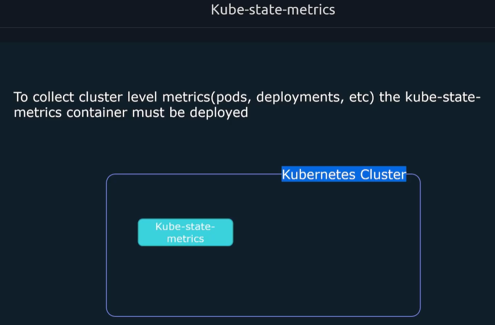
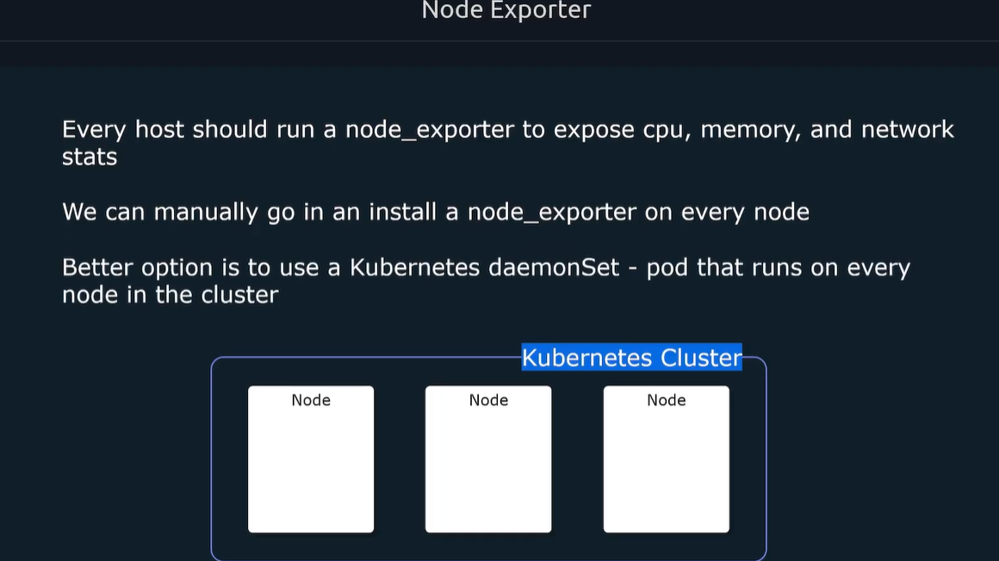
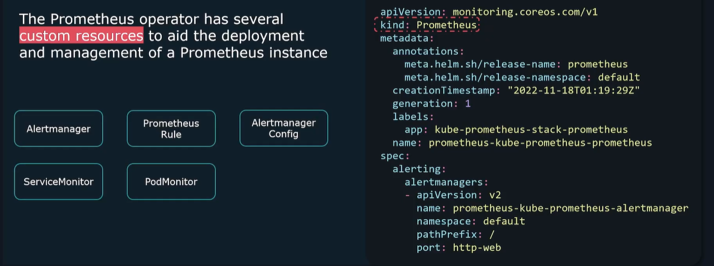

# Comprehensive Guide: Deploying Prometheus on Kubernetes Using the Prometheus Operator

Hey everyone! In this guide, we'll walk through deploying Prometheus on a Kubernetes cluster using the **Prometheus Operator** and **Helm**. This approach is specifically designed for Kubernetes environments and differs significantly from deploying Prometheus on bare metal or VMs.

---

## Why Monitor Kubernetes with Prometheus?

When running applications on Kubernetes, there are **two main things** we want to monitor:

### 1. Applications Running on the Cluster
- Web applications, APIs, microservices
- Custom application metrics (latency, errors, request counts)

### 2. The Kubernetes Cluster Itself
- **Control Plane Components** – API server, kube-scheduler, coreDNS
- **kubelet** – Exposes container-level metrics (like cAdvisor)
- **kube-state-metrics** – Cluster-level metrics (deployments, pods, services)
- **Node Exporter** – Server-level metrics (CPU, memory, disk) for each node






---

## Deploying Prometheus on Kubernetes: Why In-Cluster?

Instead of running Prometheus on a separate VM, deploying it **inside the cluster** offers several benefits:

- **Proximity to targets** – Better performance and lower latency
- **Leverage Kubernetes infrastructure** – No separate VM needed
- **Automatic service discovery** – Kubernetes API provides target discovery
- **Built-in scaling and resilience** – Use Kubernetes features like StatefulSets

---

## Understanding the Prometheus Operator

### What is a Kubernetes Operator?
A **Kubernetes Operator** is an application-specific controller that extends the Kubernetes API to create, configure, and manage complex applications like Prometheus.

### What Does the Prometheus Operator Do?
- Manages the entire lifecycle of Prometheus instances
- Handles initialization, configuration, and customization
- Automatically restarts Prometheus when configs change
- Provides **Custom Resource Definitions (CRDs)** for declarative configuration

### Custom Resources Provided by the Operator

| Resource | Purpose |
|----------|---------|
| **Prometheus** | Defines and deploys a Prometheus instance |
| **Alertmanager** | Defines and deploys Alertmanager |
| **ServiceMonitor** | Defines targets to scrape via services |
| **PodMonitor** | Defines targets to scrape via pods |
| **PrometheusRule** | Defines alerting and recording rules |
| **AlertmanagerConfig** | Defines Alertmanager routing/receiver configs |



---

## What is Helm?

**Helm** is the package manager for Kubernetes. It bundles all necessary Kubernetes manifests (deployments, services, configmaps, secrets) into a single package called a **Helm Chart**.

### Helm Chart Structure
- Collection of template YAML files
- Converts into Kubernetes manifest files
- Supports templating for customization
- Can be shared via Helm repositories

---

## Installing Helm

### Method 1: Using the Install Script (Linux)
```bash
curl -fsSL -o get_helm.sh https://raw.githubusercontent.com/helm/helm/main/scripts/get-helm-3
chmod 700 get_helm.sh
./get_helm.sh
```

### Method 2: Package Managers
- **Homebrew (Mac)**: `brew install helm`
- **Chocolatey (Windows)**: `choco install kubernetes-helm`
- **APT (Ubuntu)**: `sudo apt install helm`

### Verify Installation
```bash
helm version
```

---

## Deploying Prometheus with the kube-prometheus-stack Chart

### Step 1: Add the Prometheus Community Repository
```bash
helm repo add prometheus-community https://prometheus-community.github.io/helm-charts
helm repo update
```

### Step 2: View Available Configuration Values (Optional)
```bash
helm show values prometheus-community/kube-prometheus-stack > values.yaml
```

### Step 3: Install the Chart
```bash
helm install prometheus prometheus-community/kube-prometheus-stack
```

> **Note:** The first `prometheus` is the release name (you can choose any name).

### Step 4: Custom Installation (with custom values)
```bash
helm install prometheus prometheus-community/kube-prometheus-stack -f values.yaml
```

---

## What Does the Helm Chart Deploy?

The `kube-prometheus-stack` chart deploys all of these components:

### ✅ StatefulSets
- **Prometheus Server** – The main Prometheus instance
- **Alertmanager** – Handles alert routing and notifications

### ✅ Deployments
- **Grafana** – Visualization dashboard (pre-configured to connect to Prometheus)
- **Prometheus Operator** – Manages Prometheus lifecycle
- **kube-state-metrics** – Exposes cluster-level metrics

### ✅ DaemonSets
- **Node Exporter** – Runs on every node to collect host metrics

### ✅ Services
- ClusterIP services for all components (internal access only by default)

---

## Verifying the Deployment

### Check All Resources
```bash
kubectl get all
```

### Check Node Exporters (one per node)
```bash
kubectl get daemonsets
kubectl get nodes
```

### Check StatefulSets
```bash
kubectl get statefulsets
```

---

## Connecting to Prometheus

Since services are ClusterIP by default, you have several options to access Prometheus:

### Option 1: Port Forwarding (Quick Testing)
```bash
kubectl port-forward service/prometheus-kube-prometheus-prometheus 9090:9090
```

Then access: `http://localhost:9090`

### Option 2: Change Service Type to NodePort
Edit the service or use:
```bash
kubectl patch service prometheus-kube-prometheus-prometheus -p '{"spec":{"type":"NodePort"}}'
```

### Option 3: Create an Ingress
Define an Ingress resource to route external traffic.

---

## Accessing Grafana (Included with the Chart)

### Default Credentials
- **Username:** `admin`
- **Password:** Get it from the secret:
```bash
kubectl get secret -n monitoring prometheus-grafana -o jsonpath='{.data.admin-password}' | base64 -d ; echo
```

### Port Forward to Grafana
```bash
kubectl port-forward service/prometheus-grafana 3000:3000
```

Access: `http://localhost:3000`

---

## How the Prometheus Operator Configures Prometheus

The operator uses **Custom Resources** instead of direct Prometheus config files:

### The Prometheus Custom Resource
When you install the chart, a `Prometheus` CRD is created. It defines:
- Replicas
- Storage
- Resource limits
- **ServiceMonitorSelector** – Which ServiceMonitors to include
- **RuleSelector** – Which PrometheusRules to include

### The Underlying Secret
The Prometheus configuration is stored as a Kubernetes Secret:
```bash
kubectl describe secret -n monitoring prometheus-kube-prometheus-prometheus
```

The operator generates the `prometheus.yaml` based on your custom resources!

---

## Adding New Targets: ServiceMonitors

### What is a ServiceMonitor?
A **ServiceMonitor** defines a set of targets for Prometheus to scrape, using Kubernetes services as the discovery mechanism.

### ServiceMonitor CRD Example

```yaml
apiVersion: monitoring.coreos.com/v1
kind: ServiceMonitor
metadata:
  name: api-service-monitor
  labels:
    release: prometheus  # Important: Must match the Prometheus selector
spec:
  selector:
    matchLabels:
      app: api-service    # Matches your service's labels
  endpoints:
    - port: web           # Must match the port name in your service
      path: /swagger/stats/metrics  # Custom metrics endpoint
      interval: 30s
  jobLabel: job           # Optional: Set custom job label
```

### Service YAML Reference

```yaml
apiVersion: v1
kind: Service
metadata:
  name: api-service
  labels:
    app: api-service      # Referenced by ServiceMonitor
spec:
  selector:
    app: api              # Matches pod labels
  ports:
    - name: web           # Referenced by ServiceMonitor
      port: 3000
      targetPort: 3000
```

### Deploying the ServiceMonitor
```bash
kubectl apply -f service-monitor.yaml
```

### Verify Targets
Go to **Prometheus UI > Status > Targets** – you should see your new targets in the UP state!

---

## Adding Alerting Rules: PrometheusRule

### What is a PrometheusRule?
A custom resource that defines alerting and recording rules for Prometheus.

### PrometheusRule Example

```yaml
apiVersion: monitoring.coreos.com/v1
kind: PrometheusRule
metadata:
  name: api-rules
  labels:
    release: prometheus  # Must match Prometheus ruleSelector
spec:
  groups:
    - name: api-alerts
      rules:
        - alert: InstanceDown
          expr: up{job="node-api"} == 0
          for: 5m
          labels:
            severity: critical
          annotations:
            summary: "Instance {{ $labels.instance }} is down"
```

### Deploy the Rule
```bash
kubectl apply -f rules.yaml
```

### Verify
Go to **Prometheus UI > Status > Rules** – you should see your new rules!

---

## Adding Alertmanager Configs: AlertmanagerConfig

### Important: The AlertmanagerConfig Selector
By default, the Helm chart doesn't set a selector for AlertmanagerConfigs. You must update it:

#### Step 1: Update the Values
```bash
helm show values prometheus-community/kube-prometheus-stack > values.yaml
```

#### Step 2: Find and Update the Selector
```yaml
alertmanagerConfigSelector:
  matchLabels:
    resource: prometheus
```

#### Step 3: Upgrade the Release
```bash
helm upgrade prometheus prometheus-community/kube-prometheus-stack -f values.yaml
```

### AlertmanagerConfig Example

```yaml
apiVersion: monitoring.coreos.com/v1alpha1
kind: AlertmanagerConfig
metadata:
  name: alert-config
  labels:
    resource: prometheus   # Matches the selector
spec:
  route:
    groupBy: ['severity']
    groupWait: 30s
    groupInterval: 5m
    repeatInterval: 12h
    receiver: 'webhook'
  receivers:
    - name: 'webhook'
      webhookConfigs:
        - url: 'http://webhook-server:8080/alerts'
```

### Deploy the AlertmanagerConfig
```bash
kubectl apply -f alert-config.yaml
```

### Verify
```bash
kubectl get alertmanagerconfigs
```

Access Alertmanager UI (port forward) and check **Status > Config**.

---

## Important Notes on AlertmanagerConfig

### 🔍 Syntax Differences from Standard Alertmanager

| Standard YAML (Snake Case) | Kubernetes CRD (Camel Case) |
|-----------------------------|------------------------------|
| `group_by` | `groupBy` |
| `group_wait` | `groupWait` |
| `group_interval` | `groupInterval` |
| `repeat_interval` | `repeatInterval` |

### 🔍 Matcher Syntax

**Standard:**
```yaml
match:
  job: kubernetes
```

**Kubernetes CRD:**
```yaml
matchers:
  - name: job
    value: kubernetes
```

---

## Summary: Custom Resources Recap

| Resource | Purpose | Selector Required? |
|----------|---------|-------------------|
| **ServiceMonitor** | Defines targets for scraping via services | `release: prometheus` |
| **PodMonitor** | Defines targets via pods | `release: prometheus` |
| **PrometheusRule** | Defines alerting/recording rules | `release: prometheus` |
| **AlertmanagerConfig** | Defines Alertmanager routing/receivers | Configured via chart values |

---

## Complete Example: Deploying a Demo Application

### 1. Sample Node.js App (Express + Prometheus Metrics)
- Listens on port 3000
- Metrics endpoint: `/swagger/stats/metrics`

### 2. Deployment and Service Manifest
```yaml
apiVersion: apps/v1
kind: Deployment
metadata:
  name: api-deployment
spec:
  replicas: 2
  selector:
    matchLabels:
      app: api
  template:
    metadata:
      labels:
        app: api
    spec:
      containers:
        - name: api
          image: yourusername/prometheus-demo:latest
          ports:
            - containerPort: 3000
---
apiVersion: v1
kind: Service
metadata:
  name: api-service
  labels:
    app: api-service
spec:
  selector:
    app: api
  ports:
    - name: web
      port: 3000
      targetPort: 3000
```

### 3. Deploy the Application
```bash
kubectl apply -f app-deployment.yaml
```

### 4. Create the ServiceMonitor
```yaml
apiVersion: monitoring.coreos.com/v1
kind: ServiceMonitor
metadata:
  name: api-service-monitor
  labels:
    release: prometheus
spec:
  selector:
    matchLabels:
      app: api-service
  endpoints:
    - port: web
      path: /swagger/stats/metrics
      interval: 30s
  jobLabel: job
```

### 5. Deploy and Verify
```bash
kubectl apply -f service-monitor.yaml
```

Check **Prometheus UI > Status > Targets** for `api-service-monitor` endpoints.

---

## Conclusion

Deploying Prometheus on Kubernetes using the **Prometheus Operator** and **Helm** provides:

- ✅ Simplified deployment with one command
- ✅ Automatic monitoring of Kubernetes components
- ✅ Declarative configuration via Custom Resources
- ✅ Dynamic service discovery
- ✅ Self-healing and lifecycle management
- ✅ Built-in Grafana for visualization
- ✅ Easy scaling and updates

### Key Takeaways:
1. **Use the kube-prometheus-stack Helm chart** – It deploys everything you need
2. **Leverage Custom Resources** – ServiceMonitors, PrometheusRules, and AlertmanagerConfigs
3. **Remember the `release: prometheus` label** – Required for resource discovery
4. **Port forward for testing** – Use NodePort/Ingress for production access
5. **AlertmanagerConfig uses Camel Case** – Different from standard Alertmanager YAML

---

## Additional Resources

- **Code Cloud Prometheus Course** – From basics to advanced Kubernetes monitoring
- **Prometheus Certified Associate (PCA) Exam** – Prepare with mock exams and hands-on labs
- **Prometheus Documentation** – Official docs at prometheus.io
- **Prometheus Operator Docs** – Monitoring CoreOS documentation

---

Happy Monitoring! 🚀