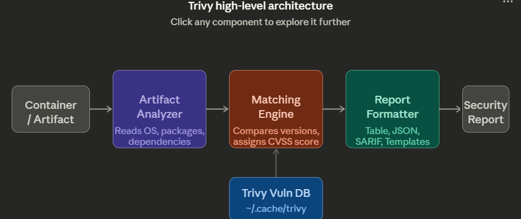
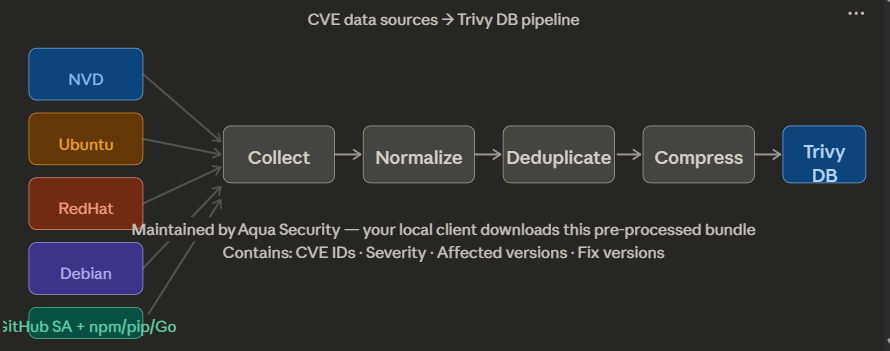
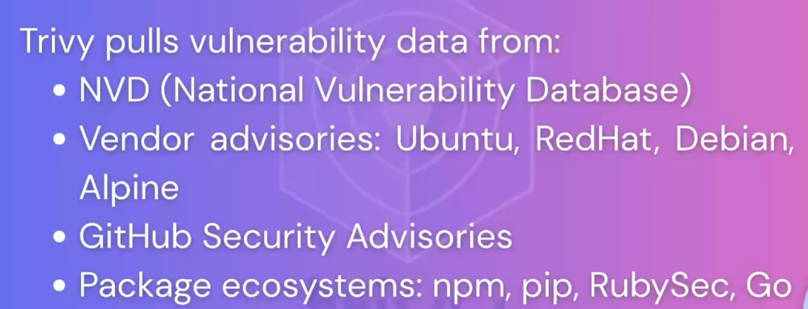
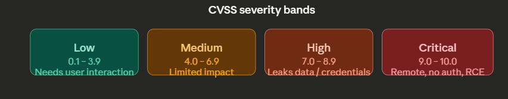
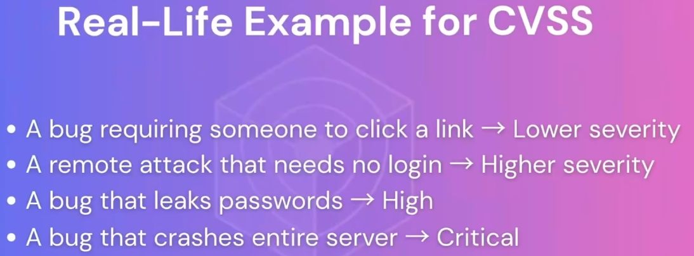

Here's a comprehensive breakdown of Trivy's internal architecture and how it works behind the scenes:

**The four core components work as a sequential pipeline** — every scan passes through each stage in order. Let me diagram the full system first, then break down each piece.Now let's walk through each component in depth.

---

## 1. Artifact Analyzer

This is the first stage — Trivy opens the container image or artifact and inventories everything inside it. Think of it like unpacking a suitcase and cataloguing every item. It does three things: reads the OS type (Ubuntu, Alpine, Debian, etc.), extracts all installed OS packages, and detects language-level dependencies like pip packages, npm modules, Ruby gems, and Go modules.

## 2. Trivy Vulnerability DB

This is the local cached database stored at `~/.cache/trivy`. It's not a live connection to the internet during a scan — Trivy downloads a pre-built, compressed bundle that Aqua Security maintains on the backend. Here's how that bundle gets built:The DB pipeline is what makes Trivy fast. Because all CVE data is pre-collected, normalized, deduplicated, and compressed into a single local bundle, your scans never need to call out to NVD or vendor advisories at runtime.

## 3. Matching Engine

Once the Artifact Analyzer has the component list and the DB is loaded, the Matching Engine cross-references them. For every installed package version, it checks against the DB's known-vulnerable version ranges, flags any matches, and assigns a CVSS severity score. The analogy from the slides is apt — it's like checking your luggage contents against a banned-items list.

## 4. CVSS Scoring

The severity assigned by the Matching Engine follows the Common Vulnerability Scoring System (CVSS). Scores run from 0–10 and factor in attack vector, attack complexity, privileges required, user interaction needed, and impact on confidentiality, integrity, and availability.## 5. Report Formatter

The final stage takes the matched vulnerabilities with their scores and produces the output. Trivy supports four formats: a human-readable **Table** for the terminal, **JSON** for programmatic processing, **SARIF** for integration with GitHub Code Scanning and other security tools, and custom **Templates** for any other format you need.

---

## The full scan flow — `trivy image nginx:latest`

1. **Pull image** — Trivy downloads the image layers
2. **Analyze layers** — the Artifact Analyzer unpacks each layer, reads the OS, and extracts every installed package and dependency
3. **Query local DB** — the Matching Engine queries `~/.cache/trivy` (no internet call needed at scan time)
4. **Match vulnerabilities** — installed versions are compared against vulnerable version ranges
5. **Generate report** — output in your chosen format (JSON/Table/SARIF)

The speed comes from step 3 — because the DB is pre-processed and local, each scan is essentially just a lookup, not a network crawl. Click any component in the diagrams above to explore it further.