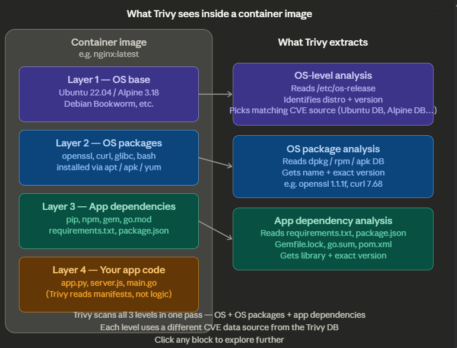

---

## OS-level analysis

When you run a container, it always runs on top of a base OS — Ubuntu, Alpine, Debian, RedHat, etc. That OS is baked into the first layer of the image.

Trivy reads the file `/etc/os-release` inside the image to answer: **"Which Linux distro is this, and which version?"** This matters because a vulnerability in `openssl` may be patched on Ubuntu 22.04 but still present on Ubuntu 20.04. Without knowing the OS, Trivy can't pick the right advisory database to check against.

Think of it like knowing which country's laws apply before checking if something is illegal.

---

## Package-level analysis (OS packages)

Every Linux distro has a package manager — `apt` on Ubuntu/Debian, `apk` on Alpine, `yum/dnf` on RedHat. These package managers keep a local database of exactly what is installed and at what version.

Trivy reads those internal package databases directly:
- `/var/lib/dpkg/status` on Debian/Ubuntu
- `/lib/apk/db/installed` on Alpine
- `/var/lib/rpm/Packages` on RedHat

From these, it extracts a list like: `openssl 1.1.1f`, `curl 7.68.0`, `bash 5.0.17`. It then checks each one against the CVE DB. This is the core of what most people mean by "OS-level scanning."

---

## Application dependency analysis (package-level for code)

This goes one level deeper — into the code your app ships. A Python app might have a `requirements.txt` listing `django==3.2.1` or a Node app might have `package.json` listing `lodash@4.17.20`. These libraries are not installed via `apt` — the OS package manager doesn't know about them. But they can still have CVEs.

Trivy reads these manifest files directly and checks each library version the same way it checks OS packages.

---

## The key insight

A container image is basically **3 vulnerability surfaces stacked on top of each other** — the OS itself, the OS packages, and your app's libraries. Most traditional scanners only check one or two of these. Trivy checks all three in a single scan, which is why it gives a much more complete picture.