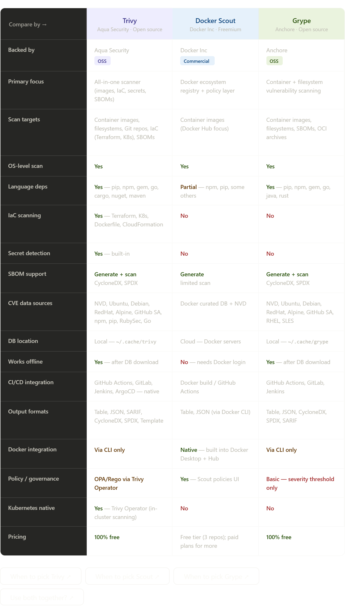

## The core philosophy of each tool

**Trivy** is the Swiss Army knife. It was built to be a single tool that does everything — container scanning, IaC scanning, secret detection, SBOM generation, and even in-cluster Kubernetes scanning via the Trivy Operator. If you want one tool across your entire DevSecOps pipeline, Trivy is the go-to.

**Docker Scout** is not really a pure vulnerability scanner — it's more of a security observability layer tightly built into the Docker ecosystem. It shines when your workflow lives inside Docker Desktop or Docker Hub. You get policy management, base image recommendations, and a nice UI out of the box, but it requires a Docker account and a cloud connection, and it can't do IaC or secrets.

**Grype** is Trivy's closest competitor in pure scanning quality. It's laser-focused — just vulnerability scanning, done very well. It pairs naturally with Syft (Anchore's SBOM generator) and is popular in teams that want a minimal, composable toolset rather than an all-in-one solution.

---

## The one-line decision guide

- Building a full DevSecOps pipeline from scratch → **Trivy** (one tool, covers everything)
- Heavy Docker Desktop / Docker Hub workflow, need a UI → **Docker Scout**
- Want the best pure scanner with composable tooling → **Grype + Syft**
- Scanning Terraform or Kubernetes manifests → **Trivy** (only one that does IaC)
- Need to work completely offline in an air-gapped environment → **Trivy or Grype** (both cache locally; Scout needs cloud)